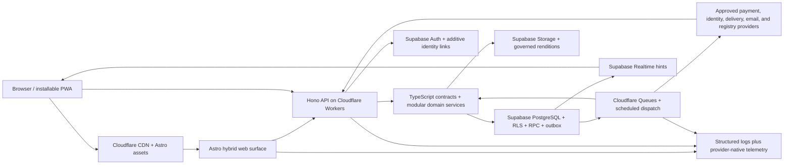

# Architecture Design Draft

> Progressive working artifact for /create-prd. Decisions are recorded here before final compilation.

## Ideation Digest

> Auto-generated from all top-level domain indexes and domain CX files on 2026-08-02. This is the primary source for entity identification, data strategy, and phasing. It does not supersede the leaf-level ideation records.

### Scope and invariants

- Project shape: one responsive web application, delivered as Astro islands with static and SSR paths via Cloudflare Workers.
- Coverage loaded: 25 top-level domains, 776 leaf features, 230 Must-have features, and 25 domain CX documents plus the global CX registry.
- Personas: Musician, Producer, Operator, and Fan. Every domain was ideated with all four role lenses.
- Locked operating constraints: no pre-revenue infrastructure spend, normal web p95 below two seconds, and 99.9% monthly availability excluding scheduled outages.

### Domain Summary

| # | Domain | Features | Sub-domains | Depth | Must Have | Roles | Key entity/workflow hints |
|---|---|---:|---:|---|---:|---|---|
| 01 | Identity, Profiles & Organizations | 24 | 6 | [BREADTH], [SURFACE] | 10 | Musician, Producer, Operator, Fan | Person Identity & Roles; Organizations & Entity Model; Membership, Representation & Mandate; Band & Ensemble Governance |
| 02 | Credits & Attribution | 23 | 4 | [BREADTH], [SURFACE], [DEEP] | 9 | Musician, Producer, Operator, Fan | Credit Graph & Discography; Session Capture; Claiming & Cold-Start Seeding; Attestation & Credit Confidence |
| 03 | Community & Networking | 29 | 7 | [BREADTH], [SURFACE] | 4 | Musician, Producer, Operator, Fan | Connections, Follows & Endorsements; Activity Feed & Ranking; Collaborator Discovery & Matchmaking; Warm Intros & the Collaboration Graph |
| 04 | Opportunities & Casting | 23 | 5 | [BREADTH], [SURFACE] | 9 | Musician, Producer, Operator, Fan | Opportunity Posting & Targeting; Discovery, Matching & Alerts; Submission & Audition; Triage, Shortlist & Decisioning |
| 05 | Services Marketplace | 32 | 7 | [BREADTH], [SURFACE] | 10 | Musician, Producer, Operator, Fan | Service Listings & Music Pricing; Quotes, Scope & Contracting; Engagement Lifecycle; Delivery, QC & Acceptance |
| 06 | Education, Lessons & Mentorship | 23 | 4 | [DEEP], [BREADTH], [SURFACE] | 8 | Musician, Producer, Operator, Fan | Lesson Booking, Packages & Delivery; Teacher Discovery, Profiles & Trials; Curriculum, Assignments & Practice; Course Marketplace & Authoring |
| 07 | Music Projects & Collaboration | 37 | 9 | [BREADTH] | 9 | Musician, Producer, Operator, Fan | Song, Release & Production Board; Songwriting & Composition Workspace; Contributors, Access & Confidentiality; Audio Version Control & Lineage |
| 08 | Real-Time Jamming & Remote Sessions | 20 | 5 | [BREADTH], [SURFACE], [DEEP] | 4 | Musician, Producer, Operator, Fan | Latency Budget & Playability; Playable Radius & Peer Matching; Remote Monitoring & Session Attendance; Talkback & Cue Mixes |
| 09 | Rights & Ownership | 26 | 6 | [SURFACE] | 7 | Musician, Producer, Operator, Fan | Rights Registry; Split Capture & Agreements; Chain of Title & Rights Lifecycle; Rights Conflicts & Disputes |
| 10 | Royalties & Collections | 28 | 5 | [BREADTH], [DEEP], [PARTIAL], [SURFACE] | 8 | Musician, Producer, Operator, Fan | Society Registration & Delivery; Statement Ingestion & Normalization; Royalty Calculation & Recoupment; Disbursement & Payee Statements |
| 11 | Music Licensing | 34 | 8 | [BREADTH], [SURFACE] | 8 | Musician, Producer, Operator, Fan | Sync Licensing; Clearance & One-Stop Status; Licence Pricing & Negotiation; Licensing Policy & Rights-Holder Preferences |
| 12 | Release & Distribution | 25 | 6 | [BREADTH], [SURFACE], [DEEP], [PARTIAL] | 11 | Musician, Producer, Operator, Fan | Release Builder & Delivery Readiness; DDEX Delivery Messaging; DSP Store & Territory Management; Release Scheduling & Windows |
| 13 | Gear Marketplace (Physical Goods) | 43 | 10 | [BREADTH], [SURFACE], [DEEP] | 15 | Musician, Producer, Operator, Fan | Canonical Gear Catalog; Condition, Originality & Disclosure; Listings & Inventory; Price Discovery & Market Data |
| 14 | Digital Goods & Plugin Marketplace | 42 | 10 | [BREADTH] | 10 | Musician, Producer, Operator, Fan | Digital Product Catalog & Compatibility; Licensing, Activation & Entitlement; Delivery, Versioning & Library; Sound Content Catalogs (Samples, Presets, Templates) |
| 15 | Gear Registry & Ownership | 24 | 5 | [BREADTH], [SURFACE], [PARTIAL] | 1 | Musician, Producer, Operator, Fan | Instrument Identity & Provenance; Stolen Gear Registry & Recovery; Service, Repair & Modification History; Gear Collection & Visibility |
| 16 | Venues, Studios & Spaces | 35 | 5 | [SURFACE] | 15 | Musician, Producer, Operator, Fan | Place Records & Rooms; Venue Technical Specification; Studio Technical Specification; Rehearsal & Practice Space Specification |
| 17 | Live Booking & Settlement | 37 | 8 | [SURFACE] | 12 | Musician, Producer, Operator, Fan | Availability, Holds & Confirmation; Offers & Negotiation; Deal Structures & Economics; Performance Contracts & Deal Memos |
| 18 | Show Production & Touring | 46 | 11 | [SURFACE] | 5 | Musician, Producer, Operator, Fan | Event Record & Lifecycle States; Bill & Support Act Management; Show Advancing; Riders |
| 19 | Ticketing & Box Office | 38 | 9 | [SURFACE] | 16 | Musician, Producer, Operator, Fan | Ticket Configuration, Scaling & Allocations; On-Sale, Announce & Presale Access; Guest List & Comps; Door Scanning & Access Control |
| 20 | Fanbase & Direct-to-Fan | 27 | 6 | [SURFACE] | 7 | Musician, Producer, Operator, Fan | Fan Graph & Owned Audience; Segmentation & Superfan Intelligence; Broadcast & Fan Messaging; Direct-to-Fan Storefront |
| 21 | Promotion & Marketing | 27 | 6 | [BREADTH], [SURFACE], [PARTIAL] | 2 | Musician, Producer, Operator, Fan | Release Campaign Planner; Pitching & Outreach; Pitch Targets & Relationship CRM; Smart Links, Pre-Save & Attribution |
| 22 | Analytics & Market Intelligence | 26 | 8 | [SURFACE] | 6 | Musician, Producer, Operator, Fan | Source Connections & Ingestion; External Identity & Catalog Matching; Playlist & Chart Tracking; Audience Geography & Tour Routing Insight |
| 23 | Career, Finance & Business Management | 29 | 7 | [SURFACE] | 1 | Musician, Producer, Operator, Fan | Income Aggregation & Financial Identity; Expenses & Tax Readiness; Invoicing & Receivables; Deal & Contract Vault |
| 24 | Trust, Safety & Disputes | 36 | 8 | [SURFACE] | 8 | Musician, Producer, Operator, Fan | Reporting, Moderation & Notice-and-Action; Enforcement, Appeals & Policy; Fraud & Risk Operations; Transaction Disputes & Protection |
| 25 | Content Management & Platform Configuration | 42 | 10 | [DEEP] | 35 | Musician, Producer, Operator, Fan; bounded internal staff account roles | Content Types & Schema Registry; Content Entries & Editorial Lifecycle; Templates, Blocks & Page Composition; Navigation, Routes & Discovery Metadata |

### Cross-Domain Dependencies

> The following global contracts are architecture-owned or architecture-constraining. Domain-level dependency maps were also read; their source coverage is recorded below.

| Source | Target domains | Type | Shared contract or invariant |
|---|---|---|---|
| Split-Capture Trigger (differentiator) | 02,05,07,09,11,12,13,14,17,20,23 | trigger | The creation-time cross-cut that captures a split the instant work is agreed. Fired from Services (05) and Projects (07) at creation. It writes into t |
| Payments, Escrow & Payouts | 05,06,10,11,12,13,14,16,17,18,19,20,23 | data | Money-movement rail: checkout, multi-party escrow, held-until-condition release, multi-vendor payouts, refunds/chargebacks/disputes, and KYC/KYB onboa |
| Tax Calculation & Remittance | 05,06,10,11,12,13,14,16,17,19,20,23 | data | Jurisdiction-aware tax determination (sales/VAT/GST, marketplace-facilitator, 1099/withholding), invoice generation, and remittance reporting. |
| Subscriptions & Entitlements | 01,06,14,20,21,22,23 | cross-domain contract | Recurring billing plans plus the entitlement/feature-gating layer that grants or revokes access from plan + billing state. |
| Object & Evidence Storage | all | data | Durable object storage for audio masters/stems, media, documents, contracts, receipts, and evidence artifacts with access-scoped signed-URL retrieval  |
| Notifications & Alerts | all | trigger | Unified fanout of events to in-app inbox, push, email, and off-platform channels, with cadence/nudge/reminder scheduling and per-user preferences. |
| Messaging & Conversations | 03,04,05,06,07,13,16,17,20,24 | cross-domain contract | Contextual direct/threaded messaging and negotiation threads attached to entities (bookings, listings, projects, opportunities). |
| Reviews, Ratings & Portable Reputation | 03,04,05,06,13,16,17,20,24 | cross-domain contract | Post-transaction reviews/ratings aggregated into a portable reputation score that travels across domains. |
| Audit Log & Provenance Ledger | all | data | Append-only, attributed record of every state-changing action and its provenance (who/what/when/why), including AI-generation disclosure attestations. |
| Roles, Permissions & Delegated Authority | all (esp 01,16,18,23) | permission | Entity-scoped RBAC plus delegated authority/representation (managers, labels, agents acting for artists/orgs) and operator permission boundaries. |
| Canonical Data, Taxonomy & Entity Resolution | all (esp 01,02,07,09,12,13,15) | data | Single canonical registry for entities (people, works, gear, releases) with taxonomy, identifier registries (ISRC/ISWC/UPC/canonical IDs), dedup/merge |
| Safeguarding & Minor Protection | 01,03,04,06,08,17,20,24 | permission | Age assurance, minor-protection guardrails, guardian consent, and restricted interaction/visibility for under-age users. |
| Localization, Currency & Timezone | all | cross-domain contract | Locale-aware formatting/translation, multi-currency display/settlement, and timezone-correct scheduling/rendering. |
| Media Handling & Audio Playback | 05,07,12,13,14,20 | data | Upload/transcode/streaming pipeline plus the audition/waveform playback surface (previews, watermarked auditions). |
| Privacy, Consent & Data Portability | all | permission | Consent/preference management, data-subject rights (export/deletion/rectification), audience/visibility scoping, and retention enforcement. |
| Search & Discovery | 03,04,05,06,13,14,16,17,20,21 | data | Cross-domain indexing, saved searches, ranking/relevance, geo/map-based discovery, and public SEO surfaces/embeds. |
| Availability, Scheduling & Reservations | 05,06,08,16,17,18 | trigger | Availability calendars, slot reservation/holds, conflict prevention, and reservation lifecycle across bookable resources (people, venues, studios, gea |
| Contracts, E-Signature & Attestation | 05,06,09,10,11,12,17,20,23 | permission | Contract/document generation, e-signature, multi-party countersign/attestation, and consent-chase escalation for pending signatures. |
| Admin Backoffice & Support Console | all (esp 10,17,19,24) | permission | Operator/support tooling for moderation, dispute handling, manual overrides, refunds, and record correction with bounded operator permissions. |
| Integrations, Public API & Webhooks | 01,12,14,20,21,22,23 | cross-domain contract | Outward integration surface: public API, signed webhooks, OAuth broker for connected accounts, DDEX/DSP partner connectors, short-link routing/click a |
| Shipping, Fulfilment & Logistics | 13,14,15,20 | cross-domain contract | Physical-goods fulfilment: shipping rate/label, tracking, delivery confirmation feeding escrow release, and returns for gear marketplace and merch. |
| Timestamped Annotation | 05, 06, 07 | cross-domain contract | Promote to a cross-cut primitive? A producer's timestamped revision note on a mix (07), a teacher's timestamped feedback on a student take (06.03.02), |
| Practice-Room Tools (tuner, click/metronome, drone, slow-downer) | 06, 07, 08 | cross-domain contract | Promote the tools (not the surface) to a cross-cut? The same tools are plausibly wanted in jam rooms (08) and sessions (07). Open Q-05, returned for g |
| Onboarding & Role-Aware Activation | 01, 02, 05, 13, 14, 16, 17, 20 | cross-domain contract | Promote one activation contract? Define the role-context, first-value milestones, resume/skip behavior, and the point at which a domain may treat a pe |
| Accessibility | 01, 06, 07, 13, 16, 19, 20 | cross-domain contract | Route accessible component, content, and critical-flow behavior as a product-wide baseline rather than per-domain work? Set the compliance target, ass |
| Promoted Placement & Advertising | 03, 04, 05, 13, 14, 20, 21 | cross-domain contract | Does the product include paid discovery, sponsorship, or advertising at all? If yes, promote one governed mechanism and define eligibility, clear adve |
| Referrals, Invites & Affiliates | 01, 03, 05, 13, 14, 20 | cross-domain contract | Does the product include invitation, referral, or affiliate incentives? If yes, define attribution, eligibility, incentive terms, and abuse controls o |
| Follow, Save & Watchlist | 03, 04, 11, 13, 14, 16, 20 | trigger | Promote one intentional-interest, collection, and alert primitive? Define which entities can be followed or saved, whether collections are private or  |
| Offline & Low-Connectivity Field Resilience | 02, 15, 17, 18, 19 | permission | Which v1 field workflows require locally durable capture, synchronization, and degraded operation? Define conflict, stale-permission, and fail-closed  |
| 56 | The domain's strongest external cross-cut: the teacher IS a gigging musician, so a gig accepted in 17 (or session in 07) is the STRUCTURAL CAUSE of te | cross-domain contract | state-race |
| 59 | 07.06.01 consumes the ratified Real-Time Rooms, Presence & Audio Transport cross-cut (D-15): a remote session's attendance IS presence in a real-time  | trigger | trigger-dependency, state-race |
| 61 | A sync pitch IS a private link with analytics — very likely the same 07.05.02 primitive (Q-03, first of four instances that make it a cross-cut). Sepa | trigger | shared-entity, trigger-dependency |
| 143 | SHARED MECHANISM, not shared feature: a producer's timestamped revision note on a mix (07) is the EXACT object as a teacher's timestamped feedback on  | cross-domain contract | shared-mechanism |
| 144 | Practice-room tools — tuner, click/metronome, drone, slow-downer — are plausibly the same objects wanted in jam rooms (08) and sessions (07). The prac | cross-domain contract | shared-mechanism, shared-entity |
| 147 | Three flows to Analytics: (a) zero-result and relaxed-query data from teacher discovery ('demand for cello teachers in Leeds') is a real cold-start le | cross-domain contract | shared-entity, other |
| 189 | 17.07's booking enquiry shares the structured-RFQ transport/messaging cross-cut with 05/06/16 but NOT the enquiry's shape; 17.12's reputation shares t | cross-domain contract | shared-entity |
| 190 | Minors buying UGC video courses trigger age-assurance and guardian-consent gates on the purchase — really a Safeguarding cross-cut (CX-M31) touching b | permission | permission |
| 195 | The provenance chain of title (15.01.04) shares the append-only attested-event-chain shape with Rights & Ownership's chain of title — one platform-lev | cross-domain contract | other |
| 202 | Boundary only (D-14): shares the CX-M14 shipping cross-cut and nothing else, must not be merged. Open question (Q-01): whether an artist-marketplace p | cross-domain contract | other |

### Architecture-Driving Implications

- Identity, membership, delegated authority, canonical entity resolution, and audit provenance must be platform primitives rather than per-domain implementations.
- Payments, taxes, subscriptions, entitlements, and payout/KYC flows require provider boundaries that prevent card data from entering application infrastructure.
- Object and evidence storage needs signed, short-lived access; immutable retention for contracts and audit material; and privacy-aware deletion/legal-hold behavior.
- Messaging, notifications, workflow triggers, and moderation actions need idempotent event delivery with durable source attribution.
- Rights, splits, credits, marketplace, booking, ticketing, and finance flows require transactional consistency, append-only evidence, and explicit state machines.
- Real-time collaboration and remote-session paths must degrade safely when network conditions cannot satisfy musical-latency requirements; the normal-web p95 target is not an audio-streaming latency guarantee.
- CMS/admin and public delivery are separate trust planes. Definitions, drafts, revisions, settings, preview grants, admin search and audit are never exposed through public read models.
- CMS schemas, templates, content, navigation and settings require immutable versions, compatibility checks, preview, risk-based approval, rollback, scheduled activation and outbox-backed cache/search convergence.
- Canonical domain records remain explicit and strongly typed; CMS bindings carry UUID/version references and cannot create authority, ownership, entitlement, settlement, verification or adjudication state.

### Source Coverage

| Domain | Index read | CX read | Decisions logged | Open questions | CX links reviewed |
|---|---|---|---:|---:|---:|
| 01 | .memory/wiki/specs/ideation/01-identity-profiles-organizations/identity-profiles-organizations-index.md | .memory/wiki/specs/ideation/01-identity-profiles-organizations/identity-profiles-organizations-cx.md | 10 | 13 | 20 |
| 02 | .memory/wiki/specs/ideation/02-credits-attribution/credits-attribution-index.md | .memory/wiki/specs/ideation/02-credits-attribution/credits-attribution-cx.md | 15 | 16 | 21 |
| 03 | .memory/wiki/specs/ideation/03-community-networking/community-networking-index.md | .memory/wiki/specs/ideation/03-community-networking/community-networking-cx.md | 9 | 12 | 13 |
| 04 | .memory/wiki/specs/ideation/04-opportunities-casting/opportunities-casting-index.md | .memory/wiki/specs/ideation/04-opportunities-casting/opportunities-casting-cx.md | 8 | 13 | 12 |
| 05 | .memory/wiki/specs/ideation/05-services-marketplace/services-marketplace-index.md | .memory/wiki/specs/ideation/05-services-marketplace/services-marketplace-cx.md | 10 | 13 | 18 |
| 06 | .memory/wiki/specs/ideation/06-education-lessons-mentorship/education-lessons-mentorship-index.md | .memory/wiki/specs/ideation/06-education-lessons-mentorship/education-lessons-mentorship-cx.md | 10 | 9 | 14 |
| 07 | .memory/wiki/specs/ideation/07-music-projects-collaboration/music-projects-collaboration-index.md | .memory/wiki/specs/ideation/07-music-projects-collaboration/music-projects-collaboration-cx.md | 12 | 13 | 11 |
| 08 | .memory/wiki/specs/ideation/08-realtime-jamming-remote-sessions/realtime-jamming-remote-sessions-index.md | .memory/wiki/specs/ideation/08-realtime-jamming-remote-sessions/realtime-jamming-remote-sessions-cx.md | 8 | 8 | 13 |
| 09 | .memory/wiki/specs/ideation/09-rights-ownership/rights-ownership-index.md | .memory/wiki/specs/ideation/09-rights-ownership/rights-ownership-cx.md | 9 | 11 | 11 |
| 10 | .memory/wiki/specs/ideation/10-royalties-collections/royalties-collections-index.md | .memory/wiki/specs/ideation/10-royalties-collections/royalties-collections-cx.md | 17 | 14 | 14 |
| 11 | .memory/wiki/specs/ideation/11-music-licensing/music-licensing-index.md | .memory/wiki/specs/ideation/11-music-licensing/music-licensing-cx.md | 11 | 9 | 24 |
| 12 | .memory/wiki/specs/ideation/12-release-distribution/release-distribution-index.md | .memory/wiki/specs/ideation/12-release-distribution/release-distribution-cx.md | 8 | 10 | 17 |
| 13 | .memory/wiki/specs/ideation/13-gear-marketplace/gear-marketplace-index.md | .memory/wiki/specs/ideation/13-gear-marketplace/gear-marketplace-cx.md | 7 | 14 | 21 |
| 14 | .memory/wiki/specs/ideation/14-digital-goods-marketplace/digital-goods-marketplace-index.md | .memory/wiki/specs/ideation/14-digital-goods-marketplace/digital-goods-marketplace-cx.md | 7 | 13 | 27 |
| 15 | .memory/wiki/specs/ideation/15-gear-registry-ownership/gear-registry-ownership-index.md | .memory/wiki/specs/ideation/15-gear-registry-ownership/gear-registry-ownership-cx.md | 10 | 10 | 19 |
| 16 | .memory/wiki/specs/ideation/16-venues-studios-spaces/venues-studios-spaces-index.md | .memory/wiki/specs/ideation/16-venues-studios-spaces/venues-studios-spaces-cx.md | 23 | 15 | 11 |
| 17 | .memory/wiki/specs/ideation/17-live-booking-settlement/live-booking-settlement-index.md | .memory/wiki/specs/ideation/17-live-booking-settlement/live-booking-settlement-cx.md | 12 | 11 | 24 |
| 18 | .memory/wiki/specs/ideation/18-show-production-touring/show-production-touring-index.md | .memory/wiki/specs/ideation/18-show-production-touring/show-production-touring-cx.md | 11 | 11 | 16 |
| 19 | .memory/wiki/specs/ideation/19-ticketing-box-office/ticketing-box-office-index.md | .memory/wiki/specs/ideation/19-ticketing-box-office/ticketing-box-office-cx.md | 9 | 13 | 21 |
| 20 | .memory/wiki/specs/ideation/20-fanbase-direct-to-fan/fanbase-direct-to-fan-index.md | .memory/wiki/specs/ideation/20-fanbase-direct-to-fan/fanbase-direct-to-fan-cx.md | 9 | 11 | 14 |
| 21 | .memory/wiki/specs/ideation/21-promotion-marketing/promotion-marketing-index.md | .memory/wiki/specs/ideation/21-promotion-marketing/promotion-marketing-cx.md | 11 | 11 | 11 |
| 22 | .memory/wiki/specs/ideation/22-analytics-market-intelligence/analytics-market-intelligence-index.md | .memory/wiki/specs/ideation/22-analytics-market-intelligence/analytics-market-intelligence-cx.md | 8 | 8 | 15 |
| 23 | .memory/wiki/specs/ideation/23-career-finance-business/career-finance-business-index.md | .memory/wiki/specs/ideation/23-career-finance-business/career-finance-business-cx.md | 7 | 9 | 11 |
| 24 | .memory/wiki/specs/ideation/24-trust-safety-disputes/trust-safety-disputes-index.md | .memory/wiki/specs/ideation/24-trust-safety-disputes/trust-safety-disputes-cx.md | 8 | 8 | 12 |
| 25 | .memory/wiki/specs/ideation/25-content-management-platform-configuration/content-management-platform-configuration-index.md | .memory/wiki/specs/ideation/25-content-management-platform-configuration/content-management-platform-configuration-cx.md | 12 | 4 | 12 |

- Global sources read: .memory/wiki/specs/ideation/ideation-index.md, .memory/wiki/specs/ideation/meta/constraints.md, and .memory/wiki/specs/ideation/ideation-cx.md.

## Stack Decisions

### Normative Technology Decision Matrix

This matrix is exhaustive for launch technology axes. A downstream team may not substitute a rejected option because it appears locally convenient; changing a row requires an architecture decision and propagation.

| Axis | Named selection | Project-specific rationale | Rejected alternatives and why |
|---|---|---|---|
| Hosting/edge | Cloudflare Pages/CDN plus Workers Paid beginning at shared staging setup | one edge control plane serves static Astro output, SSR/API, Queues, abuse controls, and immutable promotion within cost/staffing limits | Workers Free is limited to pre-setup/local evaluation and cannot be the shared staging/production posture; Vercel/Netlify add a second control plane; VM/container hosting adds patching/failover/idle cost; Kubernetes is disproportionate |
| Primary language | TypeScript plus migration-owned SQL | one contract/type system spans Astro, React, Hono, Workers, jobs, tests, and OpenAPI while SQL owns database invariants | Python/Go/Rust as a second application language duplicate contracts, builds, observability, and staffing; JavaScript without strict types weakens contract-first enforcement |
| Frontend rendering | Astro hybrid rendering with React islands | public/content routes retain cacheable server HTML while bounded workbenches hydrate only their interaction boundary | React SPA ships unnecessary JavaScript and weakens SEO/degraded delivery; Next.js/SvelteKit replace the locked Astro path; multiple island runtimes duplicate state, accessibility, and testing conventions |
| Styling | typed tokens → CSS custom properties/cascade layers; Astro scoped CSS; React CSS Modules | zero client styling runtime, direct Astro/Vite support, CSP compatibility, and one auditable token/composition authority | Tailwind creates a second utility/config authority; runtime CSS-in-JS adds hydration and style-injection CSP pressure; unscoped global CSS loses module ownership |
| Design documentation/verification | local static Astro `apps/docs` component catalog; Playwright screenshot project plus `@axe-core/playwright`; self-hosted immutable WOFF2 fonts; warm-light-only launch | reuses the selected stack, runs locally/CI without SaaS or production exposure, proves visual/accessibility states, keeps font requests first-party, and bounds launch theme scope | Storybook/Chromatic add another framework/service and cost; manual-only screenshots are non-blocking; font CDNs add privacy/CSP/availability dependencies; launch dark theme doubles token/contrast/visual scope without confirmed need |
| Backend/runtime | Hono on Cloudflare Workers as one modular backend | typed routing/middleware on the selected edge runtime without service-fleet operations | NestJS/Node adds an always-on regional runtime; FastAPI adds a second language; raw handlers duplicate routing/validation/errors; launch microservices add network failure without measured need |
| API/contracts | `/api/v1` REST/HTTP JSON, Zod 4, generated OpenAPI | explicit resources/commands, bounded query cost, shared runtime validation, cache semantics, and browser/native/provider compatibility | GraphQL permits caller-selected traversal and amplifies authorization/N+1 cost; tRPC couples consumers to TypeScript/browser assumptions; prose-only OpenAPI drifts from runtime validation |
| Relational database | Supabase Pro PostgreSQL | transactions, constraints, RLS, functions, full-text search, audit, rights/money/CMS invariants, and managed recovery fit one canonical store | Firebase/document databases weaken relational invariants and joins; raw PostgreSQL plus separate auth/storage/realtime multiplies providers and operations; a second canonical database creates reconciliation risk |
| Authentication | Supabase Auth with first-party contextual authorization | credentials/sessions share the confirmed Supabase UUID while PostgreSQL/domain policy retains authority | Auth0/Clerk add another identity processor and cost without a launch requirement; custom credentials expand security scope; provider claims/JWT metadata are rejected as authorization authority |
| Governed object storage | Supabase Storage governed by PostgreSQL metadata; Cloudflare only for deploy assets | bytes stay near Auth/RLS while rights, owner, retention, consent, hold, and publication remain canonical in PostgreSQL | R2/S3/Cloudinary create a second object policy/reconciliation plane; database byte storage harms large-object delivery; public mutable URLs cannot satisfy rights-sensitive lifecycle rules |
| Realtime | Supabase Realtime for presence and post-commit invalidation hints | reuses the selected data/auth plane and never becomes canonical authority | custom WebSocket service adds connection-fleet operations; Durable Objects wait for measured room coordination; polling-only delivery is insufficient for confirmed hints/presence |
| Search | PostgreSQL full-text, trigram, normalized/filter indexes, maintained projections | launch discovery stays transactionally aligned, permission-aware, and inside the canonical platform | Algolia/Elasticsearch/OpenSearch add cost, disclosure, async sync, deletion, and rebuild complexity before measured evidence; client-side search cannot enforce protected visibility |
| Async delivery | PostgreSQL transactional outbox plus Cloudflare Queues/scheduled dispatch | durable intent commits with business state while at-least-once transport remains replayable and disposable | queue-only writes can lose intent around commit; Kafka/SQS add another provider plane; synchronous provider work exceeds edge deadlines; Durable Objects do not replace durable business intent |
| Data access | generated `supabase-js` Data API plus migration-owned PostgreSQL RPC | preserves explicit SQL/RLS/function authority, edge compatibility, generated drift checks, and narrow repository ports | Prisma/Drizzle/general ORM create competing schema abstractions and may obscure RLS/functions; unrestricted direct SQL increases connection/authority risk; sequential calls cannot emulate atomicity |
| CMS/configuration | first-party typed/versioned PostgreSQL control plane with platform-owned Astro/React blocks | content, settings, menus, schemas, preview, publication, and audit share canonical authorization/domain references without code execution | WordPress/plugins/themes permit executable extension and split authority; external CMS adds a second identity/version/publication store; EAV-only models weaken types, migrations, and query guarantees |
| Package/build/test | pnpm/Corepack, strict TypeScript, ESLint, Prettier, Vitest, Playwright, GitHub Actions on verified self-hosted runners | aligns with Astro/Vite/Workers, frozen installs, deterministic tests, cross-browser evidence, and existing GitHub infrastructure | npm lacks the selected strict workspace model; Yarn/PnP adds compatibility variance; Bun is not the runtime; Jest/Cypress duplicate selected coverage; GitLab/custom CI adds a second source/control plane |
| Application observability | `@wejammin/observability`, Cloudflare/Supabase telemetry, provider-native diagnostics | typed scrubbed JSON, native platform evidence, release-aware exceptions/traces, and PostgreSQL audit remain separate within budget | direct console bypasses schemas; Pino/Winston add Node-oriented surface; Datadog exceeds budget/breadth; self-hosted collectors create another service; provider-native diagnostics is not business audit |
| Transactional email | Resend behind the notification adapter | bounded launch pricing, domain verification, API delivery, bounce/suppression signals, and Queue replay fit auth/transactional notices | direct SMTP expands credential/deliverability operations; multiple providers create inconsistent suppression/reconciliation; marketing automation is outside launch scope |
| Payments/onboarding | Stripe-hosted Checkout Sessions plus hosted Connect; server-reconciled PaymentIntent | keeps card/bank/KYC UI at Stripe, supports signed reconciliation, and preserves the counsel-gated single-payee model | custom card fields/embedded Checkout expand PCI/CSP/client complexity; custom bank rails expand regulation; multi-party routing/escrow remains disabled |
| Social identity | Supabase built-ins for Google/Apple/Meta plus admitted custom OAuth adapters; TikTok/BandLab conditional | additive credentials retain one canonical user and provider-by-provider admission, outage fallback, unlinking, and recovery | email-based silent merge enables takeover; provider IDs as canonical identity fragment users; enterprise SSO/SCIM is deferred; unsupported providers remain disabled |
| Abuse controls | Cloudflare rate controls/Turnstile plus PostgreSQL/domain quotas | edge bursts are rejected near ingress while durable business quotas survive distributed requests and acting-context rules | CAPTCHA everywhere harms accessibility; edge-only counters cannot enforce business limits; database-only controls spend application/database capacity before rejecting abuse |

### Hosting Platform

- **Decision:** Cloudflare Pages plus Workers, already locked during ideation.
- **Surface fit:** One responsive Astro-islands web application; static paths serve at the edge and Workers handle SSR plus dynamic first-party API requests.
- **Plan tier:** Cloudflare Workers Paid is required for shared staging and production beginning at `/setup-workspace`; Pages/CDN use the capabilities included with that selected posture. Procurement and dated price verification are deferred to setup, not tier selection. Before setup, repository/local tooling and any disposable Free-tier evaluation must keep incremental infrastructure spend at `$0` and cannot carry shared staging, production data, or production traffic.
- **Compatibility boundary:** The phase-2 native client consumes the same server-side contracts; it does not create a separate backend stack.

### Database Platform and Service Tier

- **Decision:** Supabase Pro is the approved managed PostgreSQL platform and service tier.
- **Status:** Confirmed by the owner on 2026-08-02.
- **Provisioning:** Deferred. No Supabase project or paid subscription is purchased during PRD work; `/setup-workspace` owns procurement, project creation, secrets, migrations, and connectivity validation.
- **Reasoning:** The Pro tier removes the Free-tier inactivity pause that conflicts with an always-running public service. It preserves the existing Supabase architecture lock while allowing the project to remain at $0 before workspace setup.
- **Implementation boundary:** Supabase Postgres is the transactional system of record. Authentication, row-level authorization, object storage, background work, and API deployment remain separate architecture decisions.
- **Source:** [Supabase pricing](https://supabase.com/pricing) reports the Free tier pauses after one week of inactivity; the Pro comparison lists pausing as never.

### Availability Objective (Confirmed)

- **Decision:** 99.9% monthly availability, excluding scheduled outages.
- **Status:** Confirmed by the owner on 2026-08-02.
- **Meaning:** At most 0.1% unplanned downtime per reporting month; this is approximately 43 minutes and 50 seconds in a 30-day month. The exact allowance varies with calendar-month length.
- **Design consequence:** Supabase Pro removes expected inactivity suspension. Hosting, monitoring, incident response, and planned-maintenance procedures must be specified before PRD compilation.

## Persistence Map

### Confirmed Store Boundaries

| Query category | Selection | Canonical responsibility | Non-negotiable boundary |
|---|---|---|---|
| Transactional relational state | Supabase Pro PostgreSQL | Canonical business records, permissions, audit references, workflow state, financial records, and immutable event metadata. | All authority, money, rights, and case decisions commit transactionally here. |
| Object and binary state | Supabase Storage | Object bytes for media, documents, exports, receipts, contracts, and restricted evidence. | PostgreSQL owns the object metadata, classification, owner, lifecycle, retention state, and access decision; Storage never becomes the business record. |
| Realtime user state | Supabase Realtime | Ephemeral presence, post-commit fanout, in-app updates, and safe client resynchronization signals. | Never accept authoritative business writes through Realtime; clients reload canonical PostgreSQL state after a missed or reordered event. |
| Search and discovery | PostgreSQL full-text plus normalized/filter indexes | Derived searchable fields for people, credits, catalogues, opportunities, places, products, and cases. | Search is not a second canonical store in v1; index updates happen within the PostgreSQL transaction. |
| Async delivery | Cloudflare Queues plus PostgreSQL transactional outbox | Bounded asynchronous transport for notifications, webhooks, exports, post-processing, and retries. | The outbox row is the durable intent; a queue message is disposable transport and cannot be the sole evidence of delivery. |
| Room coordination | No baseline Durable Object | None in v1 architecture. | Add only through a later decision when an evidenced room-level coordination need exceeds Supabase Realtime's fit. |

### Feature-to-Query Coverage

This is the normative approved domain and cross-cut query map. The interview artifact retains source traceability, but downstream architecture may rely on this table directly.

| Feature group | Find | Store | Relate | Rank/search |
|---|---|---|---|---|
| 01 Identity, Profiles & Organizations | people, aliases, profiles, organizations, memberships, mandates, claims | canonical identity, profile, organization, membership, mandate, verification, claim | person/profile/organization/membership/delegated authority | alias/name lookup, claim matching, verification queues |
| 02 Credits & Attribution | works, releases, sessions, credits, contributors, attestations, disputes | credit graph, attendance, attestations, provenance tiers, correction history | person → role → work/release/session; credit → split/right | credit search, discography, confidence/provenance filters |
| 03 Community & Networking | people, connections, communities, introductions, activity, CRM contacts | follow, endorsement, relationship, community, feed, private contact | person ↔ person/community; activity → source entity | feed ranking, collaborator discovery, warm-path matching |
| 04 Opportunities & Casting | opportunities, eligibility, submissions, auditions, shortlists, offers, outcomes | opportunity, requirement, application, submission, review, decision, handoff | opportunity → publisher; submission → applicant; decision → outcome | opportunity search, eligibility filters, reviewer queues |
| 05 Services Marketplace | listings, pricing, quotes, scopes, contracts, delivery, reviews | listing, catalog, quote, scope, contract, engagement, delivery, review | provider → listing; buyer → quote; engagement → payment/evidence | service search, price/location filters, reputation |
| 06 Education, Lessons & Mentorship | teachers, students, lessons, packages, curriculum, assignments, progress | availability, booking, lesson, package, curriculum, assignment, progress | teacher ↔ learner; booking → lesson; curriculum → progress | teacher search, availability filters, progress reports |
| 07 Music Projects & Collaboration | projects, songs, releases, contributors, versions, reviews, approvals | project, work item, contributor, confidentiality, version, review, approval | project → assets/people; version lineage; approval → evidence | project filters, work boards, version/approval history |
| 08 Real-Time Jamming & Remote Sessions | regions, peers, attendance, chat/talkback, network observations | session intent, peer, attendance, capability, network observation, fallback | participant → session → project; observation → device | peer matching by radius/capability; active presence |
| 09 Rights & Ownership | works, assets, rights, splits, agreements, conflicts, chain of title | rights registry, share, split sheet, agreement, evidence, dispute | work/asset → right → party; split → credit/agreement | rights lookup, conflict detection, title reconstruction |
| 10 Royalties & Collections | registrations, statements, royalty lines, recoupment, disbursement | registration, import, normalized statement, calculation, balance, payee | royalty line → work/right/payee; calculation → contract/split | statement search, unmatched queues, financial reports |
| 11 Music Licensing | licenses, clearances, one-stop status, quotes, negotiations, delivery | request, clearance, holder preference, quote, agreement, delivery | license → work/right/party; negotiation → offer; agreement → evidence | catalog search, clearance status, opportunity filters |
| 12 Release & Distribution | releases, metadata, packages, DSP territories, schedules | release, metadata, readiness, asset package, delivery message, territory | release → work/assets/rights; delivery → DSP/territory | release lookup, readiness filters, exception queues |
| 13 Gear Marketplace | gear, condition, inventory, listings, transactions, shipping, authenticity | gear catalog, condition, ownership, listing, order, shipping, authenticity | gear → owner/listing; transaction → parties/payment/dispute | faceted catalog, price/condition ranking |
| 14 Digital Goods Marketplace | products, licenses, entitlements, versions, downloads, compatibility | product, version, license, entitlement, delivery, compatibility, activation | product → creator; purchase → entitlement → account/device | catalog, compatibility filters, owned library |
| 15 Gear Registry & Ownership | instruments, provenance, ownership, theft, repair, collections | instrument identity, ownership, provenance, theft, repair, visibility | instrument → owner/service/report/listing; provenance → evidence | serial lookup, stolen-gear search, collection filters |
| 16 Venues, Studios & Spaces | places, rooms, specs, availability, access, amenities | place, room, specification, availability, policy, access, amenity | place → organization; room → place; booking → space/spec | geospatial search, capability and availability filters |
| 17 Live Booking & Settlement | availability, holds, offers, contracts, settlements, advances, guarantees | availability, hold, offer, deal, contract, settlement, payment, evidence | artist/venue → offer → contract; settlement → payment/right | availability matching, booking pipeline, reconciliation |
| 18 Show Production & Touring | events, bills, advances, riders, itineraries, tasks, incidents | event, bill, advance, rider, task, itinerary, credential, incident | event → venue/artist/crew; task → assignee; incident → evidence | run-of-show, task queues, tour search |
| 19 Ticketing & Box Office | events, inventory, presales, orders, scans, guest lists, refunds | ticket config, allocation, order, credential, scan, guest list, refund | ticket/order → event/buyer; scan → credential; refund → dispute | on-sale lookup, inventory, door exceptions |
| 20 Fanbase & Direct-to-Fan | fan graph, segments, broadcasts, purchases, memberships, consent | relationship, consent, segment, message, order, membership, preference | fan → artist; consent → channel; purchase → entitlement | segmentation, campaign targeting, supporter ranking |
| 21 Promotion & Marketing | campaigns, pitches, targets, smart links, attribution, assets | campaign, target, pitch, outreach, link, attribution, performance | campaign → release; pitch → target; event → attribution | target search, dashboards, attribution analysis |
| 22 Analytics & Market Intelligence | sources, catalog matches, charts, audience, markets, reports | connection, import, normalized metric, match, time series, report | metric → source/entity/time; match → canonical identity | trends, market ranking, routing recommendations |
| 23 Career, Finance & Business | income, expenses, invoices, contracts, budgets, taxes, forecasts | income, expense, invoice, receivable, contract, tax, forecast | financial line → party/work; invoice → payment; tax → jurisdiction | cash flow, invoice aging, tax readiness |
| 24 Trust, Safety & Disputes | reports, cases, evidence, policies, enforcement, appeals, fraud, holds | report, case, evidence snapshot, policy version, decision, sanction, appeal, signal, hold | case → actor/content/transaction; decision → policy/evidence | moderation queues, risk priority, case reconstruction |
| 25 CMS & Platform Configuration | content types, fields, entries, templates, menus, taxonomy, media, settings, flags, publication | immutable schema/template/entry/setting versions, values, navigation, approvals, manifests, migration jobs | content → schema/template/taxonomy/asset; setting → scope; publication → outbox/version | admin search, revision diff, scheduled publish, route/settings resolution |
| Global authority | actor, organization, mandate, action, scope | grants, revocations, authorization facts, policy snapshots | every protected action → acting context and authority source | permission evaluation, operator review |
| Global audit/provenance | change by entity, actor, time, reason | append-only event, hash/provenance, evidence reference | every mutable record → immutable provenance | as-of reconstruction, dispute/compliance query |
| Global objects/evidence | object by owner, lifecycle, grant, retention | metadata, checksum, classification, signed access, legal hold | domain record → object; evidence → case/contract | metadata lookup, access audit, retention sweep |
| Global payments/tax/entitlements | transaction by party, order, contract, status | payment intent, ledger, tax, entitlement, provider event | provider reference → canonical transaction; entitlement → product/account | reconciliation, payout eligibility, billing state |
| Global notifications/messaging | message/event by participant, source, preference, delivery | conversation, message, notification, preference, attempt | delivery → source event/entity and participants | inbox, unread, retry, cadence |
| Global canonical data/taxonomy | canonical/external ID, taxonomy/version, merge history | canonical entity, identifier, redirect, taxonomy, confidence | every domain → canonical UUID and taxonomy version | identifier resolution, dedupe, entity search |

### Canonical Identity and Cross-Store Consistency

All durable domain entities use a PostgreSQL-generated UUID as their canonical identifier. Every non-PostgreSQL representation carries that UUID and, where applicable, an immutable entity version. Provider-native IDs are external references only.

| Representation | Canonical ID and creation sequence | Failure recovery | Deletion and retention | Read strategy |
|---|---|---|---|---|
| Object metadata plus Supabase Storage object | Insert PostgreSQL object record in pending state, including canonical UUID, owner, classification, checksum target, and retention policy; upload under Storage RLS; verify and mark available. | A retryable verifier reconciles pending records; failed uploads stay unavailable and orphan bytes are cleaned by a scoped job. | Revoke access first. Delete bytes only when no retained reference, dispute hold, contract duty, or legal hold remains; evidence and audit references survive according to policy. | Authorize in PostgreSQL, then issue a short-lived Storage access path for the specific object and version. |
| Business mutation plus Queue message | In one PostgreSQL transaction write the business mutation, audit event, and uniquely keyed outbox record; a dispatcher emits the Queue message after commit. | Claim with a lease, retry idempotently, send exhausted delivery to a dead-letter path, and sweep undispatched outbox rows on a schedule. | Queue acknowledgment removes transport only; outbox and audit retention follow the source workflow's policy. | Consumers load the canonical entity and expected version from PostgreSQL before side effects. |
| PostgreSQL record plus Realtime event | Commit the canonical mutation first; publish only entity UUID, version, event type, and minimal non-sensitive summary after commit. | Client reconnect and resync always fetch canonical state; duplicate/out-of-order events are ignored by entity version. | Channel presence expires on disconnect; no durable deletion action is required because no authoritative state is stored there. | Client performs an authorized canonical query, then uses Realtime only to invalidate or refresh the view. |
| PostgreSQL record plus full-text index | Persist searchable normalized fields and indexed text in the same PostgreSQL transaction as the source record. | Transaction rollback keeps source and index aligned; no asynchronous projection exists in v1. | Source lifecycle and visibility state filter the index; erasure, embargo, and entitlement changes update the same transaction. | Search returns canonical UUIDs; the application performs an authorized PostgreSQL hydration query before rendering. |
| CMS control-plane version plus published projection | Persist schema/template/content/settings candidate versions and approvals in PostgreSQL; activation atomically records the active version set and outbox event. Derived public projections and Cloudflare cache entries carry that immutable publication version. | Failed projection/cache/search consumers retry idempotently; last-known-good public output remains available unless revocation, takedown, legal hold or privacy state requires fail-closed removal. | Archive/unpublish/delete/erasure/hold remain distinct; revisions and audit follow type policy, while caches and previews are purged by version. | Admin APIs read authorized control-plane entities; public APIs read only active projections and hydrate canonical domain bindings through independent authorization. |

### Security and Cost Rules

- Storage buckets remain private by default. Per-object access uses row-level policy derived from the canonical acting context, authority, consent, and retention state.
- Service-role credentials are server-only and never reach browser code or a Queue payload.
- Queue payloads contain identifiers and event versions, not raw PII, payment details, or protected evidence.
- CMS settings never store secrets or ordinary-admin-editable security, legal-floor, ledger, authority, schema-migration or transactional-state invariants.
- Preview responses are short-lived, audience-bound, noindex and excluded from public caches; public queries cannot select draft/control-plane fields.
- Spend protection is a deployment gate: Supabase Pro and any paid Cloudflare tier require explicit setup-stage budget approval before provisioning. No live service is purchased during PRD work.
### Authentication Provider and Enterprise Boundary (Confirmed)

- **Human authentication and session identity:** Supabase Auth is the confirmed provider. Its immutable user UUID is the human identity key used by all first-party records.
- **Authorization remains separate:** role facets, acting contexts, mandates, roster roles, NDA state, visibility, and commercial authority are evaluated server-side and enforced through PostgreSQL RLS. No permission decision may trust user-editable JWT metadata or a stale role claim.
- **Consumer login methods:** passwordless email magic-link/OTP remains the recovery baseline. Social identities are additive login methods attached to one canonical Supabase user UUID; any linked identity may authenticate the same account.
- **Launch social providers:** Google, Apple, Meta/Facebook, and SoundCloud. Google, Apple, and Facebook use Supabase built-ins. SoundCloud uses a custom OAuth2 provider after app-registration and minimum-profile-scope validation.
- **Deferred/conditional social providers:** TikTok is a lower-priority post-launch custom OAuth provider. BandLab remains disabled until BandLab publishes or grants an official OAuth/OIDC identity integration with stable subject identifiers and acceptable terms.
- **Identity linking:** linking starts from an authenticated session, requires recent step-up authentication, uses state/PKCE/nonce protections, and records the immutable provider subject. Verified-email automatic linking may assist, but email is never the canonical identity key.
- **Identity unlinking:** users may remove any social identity after step-up authentication only when another verified login identity remains. The final login identity cannot be removed. Link/unlink events revoke relevant sessions or provider tokens and emit security notifications plus immutable audit entries.
- **Duplicate-account merge:** if a provider identity already belongs to another Supabase user UUID, never silently merge on matching email. Require proof of control of both accounts, select one surviving canonical UUID, transactionally re-point owned records under domain-specific conflict rules, preserve redirects/audit provenance, then retire the duplicate auth account.
- **Provider data boundary:** login OAuth requests only identity scopes. Provider API access, uploads, social graph, or catalog access requires a separate consented integration grant and encrypted token lifecycle; login never grants party or resource authority.
- **Third-party claim proof:** business-listing and DSP OAuth grants are trusted server-side integration credentials, distinct from consumer sign-in identities.
- **Enterprise boundary:** enterprise SSO/SAML and all enterprise-only features are explicitly deferred until the consumer launch is ready. No launch schema, infrastructure, or delivery milestone may depend on them; later adoption requires an explicit `/evolve-feature` decision.
- **Provisioning boundary:** Supabase Auth will not be configured or billed before `/setup-workspace`, alongside the already deferred Supabase Pro purchase.
- **Release gates:** Supabase manual identity linking is currently beta and must pass setup-stage production validation before launch. Custom-provider callbacks must accept any 2xx token response rather than hard-code status 201, matching the current Supabase OAuth endpoint change.

### Primary Language (Confirmed)

- **v1 primary language:** TypeScript across the browser application, Astro server code, Cloudflare Workers, shared contracts, and automated tests.
- **Type-safety baseline:** strict TypeScript is required. External input, persisted payloads, webhooks, and other trust boundaries require runtime validation; compile-time types alone are not security controls.
- **Contract boundary:** frontend, Worker handlers, tests, and future client SDKs share one canonical TypeScript contract vocabulary. Future native clients consume the same versioned API contracts rather than creating a parallel backend model.
- **Rust boundary:** Rust is not a co-primary v1 language. It may be introduced only for an isolated, measured WASM, DSP, cryptography, or native requirement whose benefit exceeds the added build, deployment, debugging, and maintenance cost.
- **Change control:** introducing Rust or replacing TypeScript as a primary language requires an explicit `/evolve-feature` or `/propagate-decision` workflow with profiling evidence, interface boundaries, security review, and downstream spec updates.

### Product Evolution Gate — CMS and Settings-First Platform (Confirmed Direction)

- Content management is mission-critical and must be treated as a first-class platform domain, not a collection of one-off admin forms.
- The intended operating model is WordPress-like in breadth—editable structured content types, entries, controlled page templates/blocks, menus/navigation, taxonomies, media, revisions, scheduling, preview, import/export, users/capabilities, and settings—without plugins, themes, arbitrary executable templates, or arbitrary admin code.
- Product-operable variables must resolve through typed, validated, scoped, versioned settings with defaults, audit history, preview, rollback, and cache invalidation. Scattered product literals are prohibited.
- Security invariants, legal floors, financial/accounting rules, authorization semantics, database migrations, secrets, and transactional state-machine guarantees are not ordinary settings. They remain contract/code or separately governed rule packs with stronger change controls.
- CMS content may reference and compose canonical domain records, but must never convert rights, credits, money, mandates, disputes, or entitlements into generic post-type data.
- The `/evolve-feature` cascade and ambiguity rerun are complete; stack selection resumed with the CMS constraints included in every remaining axis.

### CI/CD Platform and Deployment Controls (Confirmed)

- **Platform:** GitHub Actions is the v1 CI/CD control plane for the private GitHub monorepo and the locked GitHub-to-Cloudflare deployment path.
- **Runner fleet:** jobs use the three existing self-hosted Linux/X64 runners labeled `wejammin` and `cachyos`. Heavy build/test concurrency starts at two because the runners share one eight-core, 15 GiB host; raise the cap only with measured headroom.
- **Required pull-request gates:** dependency installation from the lockfile, formatting/lint, strict type-check, unit and integration tests, applicable E2E tests, production build, migration validation/dry-run, dependency audit, secret scanning, and security-policy checks.
- **Deployment topology:** staging deploys automatically after required checks. Production deploys only from the protected release path through a GitHub `production` environment with explicit approval, serialized concurrency, environment-scoped secrets, migration readiness evidence, and rollback artifacts.
- **Artifact separation:** Astro/PWA assets, Cloudflare Worker/API code, and Supabase migrations are independently built and validated; deployment jobs declare their dependencies so migrations and application compatibility cannot race.
- **CMS release safety:** schema, template, block, settings, and publication migrations must be resumable and idempotent. Failed cache/search/sitemap projection work retries through the outbox while last-known-good public output remains active unless legal, privacy, takedown, or security state requires fail-closed removal.
- **Security boundary:** workflow permissions default to read-only and are elevated per job. Secrets are environment-scoped and never passed through logs or command-line arguments. Untrusted fork code may not execute on the self-hosted fleet; if the repository becomes public, runner isolation must be redesigned before accepting fork-triggered workflows.
- **Rejected alternatives:** GitLab CI contradicts the locked GitHub repository and runner investment; a custom CI service creates avoidable maintenance, availability, and supply-chain risk. Neither offers a project-specific benefit over GitHub Actions.
- **Setup boundary:** workflow files, environments, repository protections, Cloudflare credentials, Supabase migration credentials, runner concurrency, and any account-to-organization conversion are implemented and verified during `/setup-workspace-cicd`; no paid service is purchased during PRD work.

### Monitoring and Observability (Confirmed)

- **Application monitoring:** schema-validated structured logs plus Cloudflare and Supabase native telemetry are the v1 diagnostic boundary. No third-party monitoring account, browser telemetry SDK, trial, subscription, payment method, or usage-based monitoring plan is permitted.
- **Native telemetry:** Cloudflare Workers Observability supplies invocation logs, errors, request/CPU/duration metrics, and traces. Supabase Logs/Reports supply API, Auth, PostgreSQL, Storage, Realtime, and database-performance evidence. Native provider telemetry remains the first diagnostic stop for provider-owned failures.
- **Structured logging:** production application logs are JSON with severity, timestamp, environment, release, service, operation, outcome, latency, request/correlation ID, and safe entity/version identifiers. Correlation propagates across Worker, Supabase transaction, outbox/Queue, and external-provider calls.
- **Privacy:** logs and diagnostic events exclude names, emails, IP addresses where avoidable, tokens, secrets, payment data, evidence, private content, request/response bodies, and unrestricted URLs. Allowlisted metadata and server-side scrubbing run before any provider-native sink. Third-party PII collection and session replay are absent.
- **Sampling and quota safety:** unexpected errors are retained; native traces are sampled and high-volume expected successes are filtered. Native-provider quota notifications are configured where the selected free or explicitly approved plan includes them; monitoring pay-as-you-go is prohibited.
- **Release evidence:** every structured event carries environment and immutable release ID. CI records artifact digests, source maps remain private build artifacts when generated, and no vendor release or source-map upload occurs.
- **Alerting:** GitHub workflow failures and provider-native notifications included in the selected infrastructure cover deployment and provider failures. Application severity signals remain structured operational records reviewed through bounded operator workflows; no paid alerting service or staffed 24/7 response is claimed.
- **SLO measurement:** a scheduled GitHub health check plus Cloudflare request/error metrics measure the 99.9% monthly availability SLO. Provider-native latency distributions track the normal-web p95 `<2s` budget by route class; scheduled maintenance is separately tagged and cannot relabel an incident retroactively.
- **Audit boundary:** provider-native telemetry is diagnostic, sampled, and retention-bounded. Immutable security, financial, authority, moderation, publication, consent, and legal-hold events remain canonical PostgreSQL audit/provenance records and are never delegated to an observability vendor.
- **Rejected alternatives:** third-party monitoring vendors are rejected because nominal free signup can activate trials or paid-capable controls. Self-hosted Prometheus/Grafana/OpenTelemetry collectors create another production system whose availability, patching, storage, and alerting would need monitoring. The launch explicitly accepts reduced browser error grouping in exchange for zero unapproved service cost.
- **Admission gate:** revisit diagnostics only when measured operational evidence proves native-provider retention or debugging inadequate. A future service requires a new owner decision naming its recurring price, usage price, and hard or soft ceiling before any account is created.
- **Provider evidence:** [Cloudflare Workers Observability](https://developers.cloudflare.com/workers/observability/) documents built-in logs, metrics, and traces. [Supabase Logs](https://supabase.com/docs/guides/telemetry/logs) documents product-specific logs and cross-source correlation anchors.

### Frontend Framework and Rendering Model (Confirmed)

- **Framework:** Astro is the v1 page, routing, layout, server-rendering, and build framework. React is the only hydrated-island UI runtime; no second island framework or global client router is permitted without an explicit evolution decision.
- **Public routes:** profile/EPK, editorial, policy, help, landing, discovery, and other public read surfaces default to prerendered or cacheable server HTML with zero client JavaScript unless a concrete interaction requires hydration.
- **Dynamic routes:** authenticated, personalized, permission-sensitive, preview, freshness-critical, and mutation routes render on demand through the Astro Cloudflare adapter and server-side authorization boundary.
- **Island boundary:** React islands own complex forms, editors, bulk actions, dashboards, realtime status, media interaction, and selected PWA/offline workflows. Static prose, navigation, layout, content blocks, and read-only domain projections remain Astro/server HTML.
- **CMS rendering:** CMS schemas select platform-owned Astro/React block implementations from an approved registry. Templates define typed slots and bindings; stored content never supplies executable code, arbitrary components, CSS, imports, or client directives.
- **Data boundary:** Astro server code loads authorized read models and passes minimal validated props to islands. Islands call versioned Worker APIs for protected reads/writes; they do not query privileged tables, embed service credentials, or treat Supabase Realtime payloads as canonical state.
- **State boundary:** server/URL state is preferred. Local component state stays inside an island; cross-island client state requires a demonstrated interaction. Realtime events invalidate/refetch canonical state and never authorize a mutation or resolve protected conflicts with last-write-wins.
- **Offline/PWA:** static shell and explicitly approved workflow data may be cached. Offline mutations use typed local intents, idempotency keys, visible pending/conflict states, and server-authoritative reconciliation; private media, secrets, and unrestricted records are not placed in generic service-worker caches.
- **Performance:** JavaScript is budgeted per island and hydration uses the least eager directive compatible with the interaction. Public rendering must preserve the normal-web p95 `<2s` objective and meaningful first paint under slow mobile conditions.
- **Accessibility and provenance:** server-rendered semantics remain functional before hydration. Approved blocks enforce accessible structure, and provenance/visibility distinctions survive every template and responsive layout.
- **Future native boundary:** phase-2 native clients reuse versioned API contracts, validation schemas, design tokens, and domain vocabulary. Astro components and React DOM UI are not treated as a universal cross-platform UI layer.
- **Rejected alternatives:** a React SPA would ship unnecessary JavaScript across the many public/content routes and weaken cache/SEO/degraded delivery. SvelteKit or Next.js would replace the owner-locked Astro architecture. Multiple island runtimes would duplicate accessibility, state, testing, and bundle governance.
- **Setup boundary:** exact Astro/React versions, Cloudflare adapter, PWA integration, route manifest, island budgets, and build configuration are pinned and verified during `/setup-workspace`; this PRD decision does not install application dependencies.

### Backend Runtime and Framework (Confirmed)

- **Runtime:** Cloudflare Workers is the v1 request and event execution environment. There is no always-on Node server, container platform, Kubernetes cluster, or self-hosted application runtime.
- **Framework:** Hono provides the versioned HTTP API router, middleware composition, request validation boundary, error normalization, and runtime-portable handler contracts. Astro server routes remain thin page/BFF adapters and do not duplicate domain services.
- **Architecture:** deploy as a modular monolith with explicit domain modules and one shared contract layer. Modules may have independent tests, queues, schedules, and migrations without becoming separately deployed microservices by default.
- **Transaction boundary:** Supabase PostgreSQL functions/transactions own multi-row invariants, optimistic version checks, immutable audit, and the transactional outbox. Workers never approximate an atomic database operation through sequential network calls.
- **Request boundary:** interactive handlers authenticate the human, resolve acting context, authorize server-side, validate input, execute one bounded use case, and return a versioned result or sanitized problem response with a correlation ID.
- **Async boundary:** webhook processing, notifications, cache/search/sitemap convergence, imports/exports, migrations, media post-processing, partner delivery, reconciliation, scheduled publication, and exhausted retries run through Cloudflare Queues, scheduled dispatchers, and idempotent consumers.
- **Long work:** requests create an intent/job plus outbox event and return `202 Accepted` or the committed resource state with a status URL. Clients observe explicit queued/running/succeeded/failed/blocked/cancelled states; they do not hold an edge request open.
- **Failure semantics:** API errors use the canonical four-field envelope (`code`, `message`, `requestId`, `details`). Field errors, conflict metadata, documentation links, and retry guidance live inside `details`; HTTP status remains on the response line. Internal stack traces, SQL, policy predicates, provider payloads, and sensitive identifiers never reach clients.
- **Performance:** request handlers target normal-web p95 `<2s`, parallelize independent bounded I/O, and avoid large payloads, unbounded graph traversal, media transforms, partner polling, or CPU-heavy analysis. Set-based SQL and asynchronous work are preferred over edge loops.
- **Service communication:** v1 has no service mesh, internal gRPC, or distributed transaction coordinator. Worker modules call shared in-process services and PostgreSQL contracts; Queue events carry identifiers, event type/version, causation/correlation, and expected entity version—not raw protected data.
- **Specialized compute admission:** audio fingerprinting/transcoding, ML/model serving, large DDEX batches, or other work that exceeds Worker limits requires measured workload evidence, a typed boundary, privacy/security review, cost approval, and `/evolve-feature` before a separate runtime is introduced.
- **Rejected alternatives:** NestJS/Node adds an always-on regional server and larger runtime than the locked edge path requires. FastAPI/Python creates a second primary language and deployment system. Raw Worker handlers would save a small dependency but duplicate routing, middleware, validation, and error behavior across the broad API.
- **Setup boundary:** exact Worker compatibility settings, Hono version, deployment topology, bindings, Queue consumers, schedules, limits, and local emulation are pinned and verified during `/setup-workspace`; no application dependencies are installed during PRD work.

### API Style and Contract Boundary (Confirmed)

- **Style:** versioned REST/HTTP JSON is the platform API boundary. OpenAPI is generated from the same runtime-validated TypeScript contracts used by Hono handlers and tests; documentation is an artifact of contracts, not separately maintained prose.
- **Namespace:** first-party endpoints live under `/api/v1`. Breaking semantic or shape changes require a new major namespace or compatible migration path; additive optional fields and endpoints may remain in the current version.
- **Resources and commands:** stable entities expose resource-oriented reads and ordinary creates/updates. High-stakes transitions—approve, sign, publish, merge, release, settle, revoke, takedown, restore, erase, place/release hold—use explicit command endpoints with dedicated schemas, authority rules, idempotency, version preconditions, and audit semantics.
- **Read models:** profiles, provenance graphs, feeds, search, dashboards, analytics, admin lists, CMS delivery, and exports receive purpose-built projection endpoints. Clients cannot submit arbitrary SQL, unrestricted relationship traversal, or caller-defined nested selection that bypasses visibility and cost controls.
- **Pagination/filtering:** every unbounded collection accepts `cursor?: string` (opaque, maximum 512 characters) and `limit?: integer` (1–50, default 25) plus only endpoint-declared typed filters and sort keys. It returns `{ items: T[], nextCursor: string | null, hasMore: boolean }`. Cursors are authenticated, expire within 24 hours, and bind route, normalized filters, sort, last deterministic unique tie-breaker, audience, and acting context; tampering or cross-context reuse fails safely. Offset pagination is limited to small immutable/admin use cases with explicit justification.
- **Concurrency:** mutable resources expose immutable version/ETag metadata. Commands use `If-Match` or an explicit expected version and return `409` with safe recovery metadata on conflict; no silent last-write-wins behavior is permitted for protected state.
- **Idempotency:** externally retryable creates/commands accept a scoped idempotency key bound to actor, operation, and normalized request hash. Reuse with different payload fails; stored outcomes preserve status and resource/job references for the policy window.
- **Errors:** responses use the canonical four-field envelope with `code: string`, `message: string`, `requestId: UUID string`, and `details: Readonly<Record<string, JsonValue>>`. HTTP status remains on the response line; each error-code contract allowlists its `details` members. Absence, forbidden, conflict, blocked, stale, degraded, and dependency-unavailable remain distinct states where disclosure policy permits.
- **Authorization:** authentication never implies resource access. Each endpoint resolves human identity and acting party, evaluates current mandate/relationship/capability/NDA/visibility context server-side, and performs defense-in-depth RLS. Legal/private and admin/public projections are structurally separate.
- **Realtime:** authorized Supabase Realtime messages contain minimal entity ID/version/event hints and trigger a canonical refetch. They are not API responses, authorization claims, mutation confirmations, or durable event history.
- **Webhooks:** inbound webhooks verify provider authenticity against raw bytes, enforce replay windows, persist receipt/idempotency before acknowledgment, and process asynchronously. Outbound webhooks are versioned, signed, retried with backoff, observable, and disclose only the subscriber-authorized payload.
- **Caching:** public safe GETs support ETag/cache directives and publication-version keys. Authenticated, preview, legal/private, mutation, and settings-control responses default to private/no-store unless a documented policy proves a narrower cache safe.
- **Exports and jobs:** large exports, imports, reports, and integration operations return job resources with explicit state and expiring signed artifact access; no request waits for unbounded generation.
- **Rejected alternatives:** GraphQL's client-selected traversal and cost model amplify authorization, N+1, schema-introspection, and data-leak risk across the identity/rights/admin graphs without a confirmed client need. tRPC couples the boundary to TypeScript and browser assumptions, conflicting with native, provider, and public consumers.
- **Bootstrap:** REST is the default API style, so `api-design-principles` is the confirmed cross-cutting API design skill; GraphQL and tRPC skills are intentionally not provisioned.

### CDN, Static Assets, and Governed Media Delivery (Confirmed)

- **Topology:** Cloudflare Pages' native CDN serves deployed Astro HTML/static output and content-hashed build assets. Supabase Storage and its native CDN/Smart CDN serve uploaded object media. No baseline Cloudflare R2, S3, Cloudinary, or parallel media origin is added.
- **Build assets:** CSS, JavaScript, fonts, icons, manifests, and deploy-owned images use content hashes, immutable references, and Pages defaults. Custom cache rules are narrow and may not bypass Pages Functions, redirects, security headers, preview isolation, or deployment freshness.
- **Canonical object bytes:** audio, stems, mixes, project files, user/editorial images, video, PDFs, contracts, receipts, exports, evidence, and generated renditions remain Supabase Storage objects whose metadata, ownership, rights, consent, retention, legal hold, and references are governed in PostgreSQL.
- **Bucket/access classes:** public published renditions; authenticated private media; project-confidential media; preview-only assets; financial/legal documents; and evidence/hold material use separate policy classes and, where needed, separate buckets. Private is the default and public eligibility is an explicit published projection.
- **Upload path:** clients receive a scoped, short-lived upload authorization after server-side type/size/quota/authority checks. Resumable upload completion creates an untrusted/quarantined object record; validation/scanning/metadata extraction must pass before use or publication.
- **Renditions:** approved image/audio/video/document derivatives are allowlisted by type and purpose, versioned, and traceable to source bytes and transform version. Original bytes are never overwritten by a rendition. On-demand transforms are enabled only with cost ceilings and abuse controls.
- **Immutability:** replacement writes a new immutable object path/version and atomically repoints eligible references. Public paths include publication or asset version; mutable bytes at a stable long-lived URL are prohibited for rights-sensitive and frequently replaced content.
- **Private delivery:** authenticated downloads enforce current server/RLS policy. Signed URLs are short-lived capabilities with narrow transform/disposition scope; a newly minted token per request is avoided when it defeats safe caching, but shared tokens are never used across audiences with different authority.
- **Revocation warning:** signed URL expiry is not an immediate-revocation mechanism because edge cache lifetime can outlast token expiry. Sensitive assets use short cache/browser TTLs or authenticated no-store delivery; urgent revocation deletes/quarantines the object or rotates the immutable path and verifies CDN propagation.
- **Publication:** activation commits the public asset/reference version and outbox event. Cache, search, sitemap, and derivative consumers converge idempotently; public pages keep last-known-good versions unless security, rights, consent, privacy, takedown, erasure, or legal state requires fail-closed removal.
- **Deletion/hold:** unpublish, archive, delete, anonymize, takedown, erasure, and legal hold are distinct. Purge workflows enumerate originals, renditions, signed/public paths, browser-TTL exposure, exports, and downstream references; completion is evidenced rather than assumed.
- **Performance/cost:** responsive images and bounded audio streaming/range behavior are tested against the p95 budget and mobile conditions. Egress, transforms, cache-hit rate, object growth, and abusive download patterns have dashboards and hard admission controls before paid overage.
- **Provider evidence:** [Cloudflare Pages serving docs](https://developers.cloudflare.com/pages/configuration/serving-pages/) document native Tiered Cache and deploy-aware asset behavior. [Supabase Storage CDN docs](https://supabase.com/docs/guides/storage/cdn/fundamentals) document CDN delivery and private/public cache differences; [Smart CDN docs](https://supabase.com/docs/guides/storage/cdn/smart-cdn) document Pro-plan revalidation and the signed-URL cache/revocation caveat.
- **Setup boundary:** bucket creation, policies, limits, custom domains, headers, transform settings, scanning path, cache TTLs, egress controls, and purge drills are deferred to `/setup-workspace-data` and infrastructure verification.

### Product Design Direction and Governance (Confirmed)

- **Register and north star:** the default register is product, not brand. **The Working Record** is the creative north star: a practical session record, human liner notes, and an exact provenance label combined into one professional system.
- **Audience and context:** v1 serves working musicians, producers, engineers, bands, and venue/studio operators across phones, studios, venues, loading docks, and desks. Fan-facing routes remain simpler consumer surfaces under the same brand, not professional dashboards exposed to a different persona.
- **Personality:** credible, human, exact. Copy is plainspoken, calm, accountable, and specific. The interface acknowledges uncertainty and degraded state rather than projecting false confidence or using hype to cover missing evidence.
- **Visual strategy:** a restrained warm-light system is the default for mixed ambient light. Jam Magenta (`oklch(60% 0.25 350)`) is the sole vibrant brand accent and occupies no more than 10% of a screen. Semantic danger, warning, and success colors are reserved for literal status and never become secondary brand accents.
- **Typography:** Source Sans 3 owns product controls, forms, tables, settings, moderation, admin, and sustained reading. Source Serif 4 is limited to public profile names and major editorial moments. IBM Plex Mono is limited to identifiers, timestamps, versions, and provenance metadata. Product heading sizes are fixed; fluid display type is public-surface only.
- **Density and structure:** product workflows use compact predictable controls, aligned records, lists, sections, and tables. Containers exist only when an object needs an independent boundary. Nested cards, interchangeable card grids, hero metrics, decorative waveform motifs, and profile-completion gamification are prohibited.
- **Provenance contract:** material facts render their own source and state. Asserted, counterparty-confirmed, verified, disputed, pending, unavailable, failed, and absent states remain distinguishable through readable labels, semantics, iconography, and structure; color never carries the distinction alone.
- **CMS boundary:** legitimate visual variability resolves through typed design tokens and approved settings. CMS templates compose approved blocks within named slots but cannot override the profile Header → Now → Record → Detail spine, provenance treatments, focus/contrast/error behavior, authorization, or transactional invariants. Arbitrary themes, plugins, scripts, CSS, imports, and expressions remain prohibited.
- **Motion and elevation:** feedback is responsive rather than choreographed, normally 150–220 ms with exponential ease-out. Layout properties, bounce, elastic motion, and orchestrated product page loads are prohibited. Surfaces remain flat at rest; low-alpha elevation indicates a temporary layer or active state only.
- **Accessibility:** WCAG 2.2 AA is a release gate for public, authenticated, admin, and PWA routes. Keyboard operation, visible focus, semantic structure, screen readers, zoom/reflow, target size, non-color cues, and reduced motion are mandatory. CMS checks supplement human review, and inaccessible block types leave the approved registry.
- **Canonical artifacts:** root `PRODUCT.md` owns strategy; root `DESIGN.md` owns normative visual tokens and rules; `.impeccable/design.json` mirrors non-Stitch metadata and component examples. Architecture and frontend specifications cite these files rather than inventing local visual values.
- **CSS architecture:** launch styling uses repository-owned vanilla CSS: typed design tokens compiled to CSS custom properties, named cascade layers, Astro scoped styles for page/component ownership, and CSS Modules for React islands. Global reset, tokens, typography, utilities, and shared primitives live in `packages/ui`; feature code may consume but not redefine them. Tailwind, runtime CSS-in-JS, arbitrary CMS CSS, and a second styling system are prohibited unless admitted through `/evolve-feature`.
- **CSS rationale:** this choice adds no client styling runtime, works directly with Astro's compiler and React's build-time module support, keeps CSP free of runtime style injection, and makes the governed token source auditable across public/product/admin surfaces. Tailwind is rejected because its independent utility/config grammar would create a second token and composition authority; runtime CSS-in-JS is rejected because it adds hydration/runtime work, style-injection CSP pressure, and framework coupling; unscoped global CSS is rejected because ownership and collision behavior would diverge across modules.
- **Component catalog and visual regression:** `apps/docs` is a local/CI-only static Astro catalog importing `packages/ui`; it renders every primitive, archetype shell, density, provenance state, error/offline state, viewport, and reduced-motion mode. A tagged Playwright project inside `pnpm test:e2e` owns committed deterministic screenshots and `@axe-core/playwright` checks; changed baselines require reviewed visual evidence. Storybook, Chromatic, and manually asserted visual parity are not launch tooling.
- **Font delivery:** approved Source Sans 3, Source Serif 4, and IBM Plex Mono WOFF2 files are self-hosted as content-hashed Cloudflare deploy assets with explicit preload/use rules and license records. No third-party font CDN or runtime font fetch is allowed. Launch does not subset fonts; a future subset pipeline requires glyph/language completeness, license, cache, and visual-regression proof through `/evolve-feature`.
- **Launch theme:** the confirmed warm-light theme is the only launch theme. Dark theme is disabled rather than partially implemented; admitting it requires `/evolve-feature`, complete semantic token coverage, WCAG contrast evidence, all catalog screenshots, media/logo review, and saved-preference behavior.
- **Setup boundary:** `/setup-workspace` pins the selected catalog/test/font package and asset versions, generates the initial reviewed baselines, and proves CI/build integration; it does not select an alternative mechanism. No ungoverned hard-coded visual value is authorized.

### Development Toolchain and Canonical Commands (Confirmed)

- **Workspace manager:** pnpm workspaces is the sole JavaScript/TypeScript package and script runner. Corepack pins the exact pnpm release in repository metadata, `pnpm-lock.yaml` is committed, CI uses frozen-lockfile installation, and workspace dependencies use the `workspace:` protocol.
- **Unit/integration runner:** Vitest is the primary TypeScript test runner because it shares Astro/Vite resolution and supports separate projects for contracts, domain code, Worker/Hono handlers, database adapters, and browser-backed React components. Tests run in deterministic `run` mode in CI; watch mode is local only.
- **Coverage:** Vitest coverage uses V8 for Node/Chromium-compatible projects with explicit source inclusion so unimported files count. Cloudflare-runtime-only behavior is not claimed covered by unsupported V8 instrumentation; it receives request/integration/E2E tests in the actual Worker-compatible environment.
- **Browser and E2E:** Playwright owns production-preview E2E, hydration, responsive, accessibility-smoke, PWA, auth, CMS publication, and critical provenance workflows. Chromium is the pull-request baseline; WebKit/Firefox expand in protected nightly/release jobs because the self-hosted fleet begins with two heavy jobs concurrently.
- **Linting:** ESLint flat config with pinned ESLint/Astro plugin compatibility owns correctness, TypeScript-aware rules, Astro templates, React hooks, import boundaries, security-sensitive patterns, and static accessibility checks. Recommended plugin configurations are pinned rather than floated because the Astro plugin may add findings in minor releases.
- **Formatting:** Prettier and the official `prettier-plugin-astro` own formatting. ESLint formatting rules are disabled through the compatibility config. CI runs `prettier --check`; only explicit local `format` or `lint:fix` commands mutate files.
- **Type checking:** `pnpm type-check` runs strict workspace `tsc --noEmit` checks plus `astro check`. Worker binding/type generation and its validation join this command after Wrangler configuration exists. Build output is never treated as a substitute for type diagnostics.
- **Build:** `pnpm build` produces the Astro/Cloudflare production artifact and any dependency-ordered workspace packages. It must fail on unresolved contracts, invalid content/schema generation, or adapter configuration and may not fetch mutable remote build inputs without an explicit reproducibility exception.
- **Canonical scripts:** `pnpm test`, `pnpm test:watch`, `pnpm test:coverage`, `pnpm test:e2e`, `pnpm lint`, `pnpm lint:fix`, `pnpm format`, `pnpm format:check`, `pnpm type-check`, `pnpm build`, `pnpm dev`, and `pnpm validate` are the only CI/documentation interfaces. Underlying CLI flags remain package implementation details.
- **Validation order:** `pnpm validate` runs `pnpm format:check && pnpm lint && pnpm type-check && pnpm test:coverage && pnpm test:e2e && pnpm build`. GitHub Actions may split these into dependency-aware jobs for speed, but required checks preserve equivalent coverage and the final gate aggregates every result.
- **Rejected alternatives:** npm lacks pnpm's workspace protocol and strict content-addressed install model; Yarn/PnP adds compatibility variance without a demonstrated benefit; Bun is not the selected production runtime; Jest duplicates Vite transforms; Cypress duplicates the selected cross-engine Playwright path; Biome-only lint/format is deferred while Astro support remains experimental.
- **Setup boundary:** exact Node, pnpm, Vitest, Playwright, ESLint, Prettier, TypeScript, Astro plugin, browser, coverage thresholds, test projects, shard strategy, and script implementations are pinned and proven during `/setup-workspace`; this decision defines interfaces without installing dependencies during PRD work.

### Structural UI Architecture (Confirmed)

- **Canonical contract:** `.memory/wiki/specs/design-system.md` defines the navigation, grid, archetypes, global component seed, motion, density, and state language consumed by every frontend specification. Root `DESIGN.md` remains the visual-token contract; the two documents are complementary and neither may be replaced by feature-local conventions.
- **Adaptive navigation:** authenticated wide screens use collapsible sidebar plus global top bar; compact PWA routes use four context-relevant bottom destinations plus More and stack navigation; public content uses a minimal top navigation; admin uses a separate capability-gated shell. Named CMS menu locations configure eligible items without owning authorization or recovery routes.
- **Grid:** 4/8/12 responsive columns with 16/20/24px gutters and a 1440px application maximum. CSS Grid owns two-dimensional work surfaces and Flexbox owns linear controls. Public reading remains 65–75ch and generally within 1200px.
- **Archetypes:** public record, work queue, list/detail workbench, record/activity, guided transaction, collaboration/review, CMS editor/preview, admin operations, settings/registry, content/discovery, auth/claim/recovery, and system/degraded are the locked page families.
- **Component seed:** global navigation, acting-context, workbench, typed form, query/table, provenance/state, timeline/audit, task/notification, feedback, upload/media, CMS composition, capability, and offline/conflict primitives are owned centrally. Feature specs extend this seed but may not redefine equivalent global components.
- **Motion:** subtle responsive feedback at 150–220ms, exponential ease-out, no layout animation, no choreography gate, and instant/≤100ms opacity-only reduced-motion behavior.
- **Density:** hybrid by archetype. Tables, schedules, queues, timelines, registries, and admin are compact; records, forms, collaboration, and inspectors are standard; public identity/content/auth and focused recovery are spacious. Accessibility constraints are invariant across density.
- **State honesty:** skeletons render only for known-existing regions; identity/canonical state resolves first; last-known-good content is labeled stale when safe; inline, toast, full-page, and boundary errors are selected by scope/persistence. Absent, forbidden, offline, unavailable, failed, stale, blocked, pending, and disputed never collapse into one state.

### Data Access Layer (Confirmed)

- **No general ORM:** application data access uses generated `supabase-js` types, the Supabase Data API/PostgREST, versioned views/read models, and migration-owned PostgreSQL functions. Prisma, Drizzle, and another schema-owning ORM are not launch dependencies.
- **Ordinary access:** allowlisted single-resource reads/writes use typed Data API calls under explicit grants and RLS. Public, authenticated, admin, legal/private, and preview projections are separate schemas/views where disclosure risk requires structural separation.
- **Atomic access:** multi-row invariants, optimistic version checks, scoped idempotency, immutable audit, ledger/rights transitions, and transactional outbox writes execute in one PostgreSQL transaction exposed through narrowly granted RPC functions.
- **Function security:** `security invoker` is the default. Every `security definer` function fixes an empty `search_path`, schema-qualifies objects, revokes default execution, grants only named roles, validates acting context, and receives dedicated authorization tests.
- **Direct SQL boundary:** direct connections are limited to migrations, backup/restore, diagnostics, and a measured server-only query escape hatch. Edge/serverless traffic uses Supabase's supported transaction-pooler path when direct SQL is admitted and disables prepared statements when the pool mode requires it.
- **Type drift:** generated database types are artifacts of committed migrations, not the domain contract. CI regenerates and diffs them; runtime API/domain schemas remain explicit and prevent database rows from leaking directly to clients.
- **Provider evidence:** Supabase documents generated TypeScript support for `supabase-js`, RLS-backed Data API access, database functions for data-intensive operations, and transaction pooling for edge/serverless clients.

## System Architecture

### Component Diagram



### Communication Protocol Matrix

| Path | Protocol and contract | Trust, timeout, and retry rule |
|---|---|---|
| Browser → Cloudflare CDN | HTTPS document/asset request with ETag and cache directives | shared cache contains publication-approved output only; browser retries safe GETs only |
| Cloudflare CDN → Astro web surface | Cloudflare edge dispatch preserves the HTTPS request to the deployed Astro Worker on cache miss/dynamic route | immutable deployment binding; cache bypass on private/preview routes; origin failure uses CDN/Astro fallback policy |
| Astro web surface → Hono API | in-process Fetch `Request`/`Response` through the imported Hono app's `app.request` contract | no loopback HTTP; shared request ID/session context; validated API response; deadline propagated |
| Browser → Hono API | HTTPS `/api/v1` JSON validated by Zod/OpenAPI | session plus CSRF/origin policy where applicable; retry only safe/idempotent operations within exact deadline |
| Hono API → Supabase Auth | server-side Supabase Auth client over TLS validates/refreshes the session identity | bounded call; auth ambiguity fails closed; provider/service credentials never reach browser/domain DTOs |
| Hono API → domain services | direct typed TypeScript command/query port; transport input converts to validated domain DTO | dependency direction is transport → application port; typed result/error only; no Hono/provider/row object enters domain code |
| Domain services → Supabase PostgreSQL | typed repository port; infrastructure adapter uses `supabase-js` Data API or migration-owned RPC over TLS | RLS/RPC and transaction contract apply; domain imports the port, never the Supabase client; ambiguous write fails closed |
| Domain services → Supabase Storage | typed object port; infrastructure adapter uses scoped signed HTTPS/TUS upload/download operations | PostgreSQL metadata authorizes every operation; pending verification and version rules apply; no direct bucket authority in domain/client code |
| Supabase PostgreSQL → Supabase Realtime | managed post-commit logical-change/broadcast feed containing authorized entity/version hints | no pre-commit publication and no canonical payload; channel authorization and version filtering apply |
| Supabase Realtime → Browser | authorized WSS change hint containing entity ID/type/version | hint is non-authoritative; reconnect, gap, duplicate, or reorder triggers/uses canonical refetch |
| Supabase PostgreSQL outbox → Cloudflare Queue | scheduled dispatcher leases rows through SQL/RPC then sends versioned identifier-only events through the Queue binding | durable intent precedes at-least-once transport; idempotent dispatch; bounded retry; dead-letter plus replay |
| Cloudflare Queue → domain services | consumer validates versioned event, reloads canonical state, then invokes direct typed TypeScript command port | current authority/state/version checked before action; domain result controls acknowledgment, retry, or terminal state |
| Cloudflare Queue → approved providers | typed adapter sends provider HTTPS API request with provider idempotency | provider-specific timeout/backoff/circuit; ambiguous outcomes reconcile before retry |
| Approved providers → Hono API | HTTPS raw-body webhook plus provider signature and replay timestamp | persist receipt/idempotency before acknowledgment; process asynchronously; invalid signature/replay fails closed |
| Astro web surface → diagnostics | safe user-facing error boundaries expose request IDs; server-rendered failures use the shared structured logger | no browser telemetry SDK; diagnostic failure never changes render/business outcome |
| Hono API → Cloudflare diagnostics | `@wejammin/observability` emits scrubbed, release-tagged JSON to the Worker console sink | non-blocking and request-correlated; business audit remains PostgreSQL |
| Cloudflare Queue → Cloudflare diagnostics | consumer boundary emits scrubbed, attempt/job-correlated structured events | non-blocking; telemetry failure never changes acknowledgment or canonical business state |

### Component Failure and Fallback Matrix

| Component failure | Required fallback and recovery |
|---|---|
| Cloudflare CDN/Astro | serve last-known-good public output when policy-safe; show maintenance/degraded state; protected writes never use stale authority |
| Hono Worker | canonical error envelope with request ID; no unsafe automatic mutation retry; rollback immutable application artifact |
| Domain application service | typed failure aborts the transaction/use case before success is asserted; caller maps retryability and safe exposure; invariant failure never becomes a partial provider side effect |
| Supabase Auth | existing authorization is revalidated; new login/link/recovery fails closed; unrelated public content may remain available |
| PostgreSQL/Data API/RPC | protected writes fail closed; no success is asserted; queue consumers pause and later re-read canonical state after restore |
| Supabase Storage | metadata remains authoritative; affected object is unavailable/pending; verifier retries and public projection retains only policy-safe last-known-good rendition |
| Realtime | UI marks stale/offline where relevant and polls/refetches canonical state; no committed action depends on message receipt |
| Outbox/Queue | durable outbox retains intent; dispatcher/consumer retries; exhausted attempts become visible dead-letter work with current-state replay |
| External provider | local state remains pending/degraded; circuit opens; signed webhook or explicit reconciliation establishes finality |
| provider-native telemetry | product continues; provider-native logs/domain audit remain; telemetry blind-spot alert is raised through an independent channel where available |

### Runtime and Deployment Topology

- **One product, explicit surfaces:** public pages, authenticated product, installable PWA routes, and capability-gated administration are route families in one Astro application. They share contracts and design tokens but use separate shells, authorization policies, cache rules, and error boundaries.
- **Edge request plane:** Cloudflare serves immutable assets and cached public Astro output. Dynamic Astro routes and `/api/v1` execute on Workers. Hono owns API middleware, authentication context, validation, authorization orchestration, error normalization, and response headers.
- **Modular monolith:** domain modules compile into the Worker deployment but own separate contracts, services, repositories, migrations, policy tests, audit vocabulary, and queue handlers. Cross-domain calls use exported use-case contracts, never another module's tables or private implementation.
- **Canonical state plane:** Supabase PostgreSQL is the relational authority. Supabase Auth owns credentials and sessions; application authorization remains in PostgreSQL/domain policy. Supabase Storage owns governed bytes while PostgreSQL owns every object's metadata and lifecycle. Realtime carries invalidation hints only.
- **Asynchronous plane:** a transaction writes domain state, immutable audit, and outbox rows atomically. A dispatcher publishes minimal versioned messages to Cloudflare Queues. Idempotent consumers perform notification, webhook, projection, delivery, reconciliation, and approved media work, recording attempt and terminal state.
- **External boundary:** every provider sits behind a typed adapter with explicit timeout, retry, idempotency, signature-verification, disclosure, and degradation behavior. Provider payloads do not become domain contracts and provider success never substitutes for local committed state.
- **No launch microservices:** there is no service mesh, Kubernetes, permanent VM, independent GraphQL server, or second canonical database. A service is extracted only after measured isolation, scale, runtime, legal, or organizational pressure and a migration plan prove the extra boundary worthwhile.

### Data Flow Lifecycle

1. The client loads a versioned Astro document and content-hashed assets from Cloudflare; public cached output contains only publication-approved data.
2. A dynamic request receives a UUID request ID at the first edge boundary. The server verifies the Supabase session, resolves the canonical user and current acting party, and loads current capability/mandate context.
3. Runtime contracts validate path, query, headers, and body before the use case runs. Authentication, validation, and authorization are distinct failures.
4. The domain service executes one bounded use case. Ordinary allowlisted access uses generated Supabase types and RLS-backed Data API calls; protected multi-row transitions use one migration-owned PostgreSQL RPC transaction.
5. The transaction commits canonical state, version metadata, audit evidence, idempotency result, and outbox events together. A failed commit produces no externally asserted success.
6. The response returns the committed representation or a job/status resource. Private responses default to `no-store`; safe public reads use publication-version cache keys and ETags.
7. Outbox dispatch and Queue consumers converge notifications, cache/search/sitemap projections, external delivery, and other side effects. Consumers re-read canonical state, reject stale versions, and are safe to replay.
8. Realtime sends minimal authorized entity/version hints. Clients refetch the canonical projection and never treat a realtime payload as an authority grant or mutation receipt.
9. structured logs correlate browser, Worker, database/RPC, queue, and provider activity through request, correlation, causation, job, and safe entity-version identifiers.

### API Surface

| Surface | Boundary | Purpose | Default Cache | Authority |
|---|---|---|---|---|
| Public web | Astro pages plus public `/api/v1` projections | profiles, published CMS content, discovery, provenance-safe records | versioned public cache where eligible | publication state and public projection policy |
| Authenticated product | Astro/React islands plus `/api/v1` resources and commands | projects, collaboration, marketplace, education, rights, settings | private/no-store | user + acting party + relationship/capability policy |
| Admin | separate admin shell plus explicit admin command endpoints | CMS, menus, registries, moderation, operations, governed settings | no-store | named capability, reason, freshness, audit; step-up for high risk |
| PWA/offline | installable shell plus approved local intent queue | resilient reading and draft/intent capture | bounded local cache | server revalidation before any authoritative transition |
| Webhooks | raw-body ingress and signed versioned egress | provider events and subscriber delivery | no-store | provider signature, replay window, subscription policy |
| Jobs | status resources and expiring artifacts | imports, exports, reports, long integrations | private/no-store | initiating actor or delegated operational capability |

### Domain Boundary Ownership

- **Identity and parties** owns canonical humans, organizations, acts, acting context, mandates, aliases, additive external credentials, and account recovery. Other domains reference party/user IDs and cannot infer authority from a social provider.
- **CMS and platform configuration** owns typed content models, templates, approved block registry, named menu locations, navigation records, setting definitions, scoped values, publication workflow, preview, revision history, and configuration audit. It cannot override authentication, authorization, transactional invariants, legal holds, provenance semantics, accessibility, or design-system constraints.
- **Projects and collaboration** owns sessions, memberships, artifacts, contribution records, reviews, and collaboration state; governed media bytes remain in Storage under database-owned object records.
- **Rights, provenance, commerce, services, education, venues, and operations** each own their state machines and invariants. Shared workflows coordinate through typed commands/events and canonical IDs rather than table-level coupling.
- **Notifications and integrations** own delivery attempts, subscriptions, templates, and provider adapters but not the business fact being announced. They re-check current consent, eligibility, and disclosure at send time.
- **Audit and evidence** is append-only domain evidence written with protected transitions. provider-native logs are operational diagnostics, not substitutes for business audit, consent, money, rights, or legal records.

### Deployment Strategy

- GitHub Actions produces one reproducible build from the locked pnpm workspace and promotes the same immutable artifact through preview, staging, then production; production is never rebuilt from mutable inputs.
- Pull requests require formatting, lint, strict type checking, contract/unit/integration coverage, migration validation, security checks, and build. Protected staging adds Worker-runtime integration, browser E2E, accessibility smoke, and infrastructure verification.
- Database migrations are forward-only, reviewed, transaction-safe where PostgreSQL permits, and backward compatible with the currently deployed application during rollout. Destructive cleanup follows measured compatibility and rollback windows.
- Releases use expand → migrate/backfill → switch/read → contract. Feature/configuration activation is separately auditable and defaults off for incomplete or counsel-gated capabilities.
- Rollback restores the prior application artifact and compatible configuration. Data repair uses an explicit compensating migration or command; no rollback assumes committed business events can be silently erased.
- Availability target is 99.9% monthly excluding announced scheduled maintenance. Scheduled work uses maintenance/degradation communication; unplanned failures are incidents even when the mathematical SLO budget is not yet exhausted.

## Error Architecture

### Global Error Envelope

Every JSON API failure returns exactly these four top-level fields; all four are present on every error response:

```json
{
  "code": "VALIDATION_FAILED",
  "message": "Email address is not valid.",
  "requestId": "018f0c45-73fe-7dc2-9c09-68f7ecf132d4",
  "details": {
    "field": "email",
    "reason": "must contain @"
  }
}
```

- `code: string` is 1–64 uppercase ASCII characters matching `^[A-Z][A-Z0-9_]*$`; it is a stable machine-readable contract and clients never branch on message text.
- `message: string` is 1–500 Unicode characters, safe, user-presentable, and localizable. It does not disclose policy predicates, existence, provider internals, SQL, stack traces, or protected identifiers.
- `requestId: string` is a valid UUID created at the first trusted request boundary and propagated through logs, RPC context, jobs, and provider calls.
- `details: Readonly<Record<string, JsonValue>>` is always a JSON object, using `{}` when no safe details exist. It is limited to 16 keys, four levels, and 8 KiB serialized; every error code allowlists exact member names and schemas. Only typed field errors, retry guidance, documentation URI, expected/current versions, blocked-state reason codes, or safe recovery actions may be admitted.
- HTTP status remains in the response status line. Top-level `status`, `error`, `timestamp`, provider payloads, and raw exception text are prohibited.

### Error Propagation Chain

1. PostgreSQL constraints, RLS, RPC functions, and provider adapters translate failures into typed internal categories at the boundary that understands them.
2. Domain services add safe operation context and map invariant, authorization, conflict, blocked, dependency, and retryability semantics without exposing storage/provider vocabulary.
3. Hono middleware or the Astro server boundary maps the typed error to HTTP status and the four-field envelope. Unknown errors become `INTERNAL_ERROR` with no internal details.
4. Clients map `code` and response context to field, inline, boundary, or full-page states while retaining `requestId` for support.
5. A failure is logged once at its owning boundary. Upstream layers add tracing context but do not repeatedly log-and-rethrow the same event.

Validation is `400`/`422` by contract; unauthenticated is `401`; authenticated-but-forbidden is `403`; policy-safe absence is `404`; optimistic/idempotency conflict is `409`; rate limiting is `429`; retryable dependency failure is `502`/`503`; deadline is `504`. Exact endpoint mappings are contract-tested and may deliberately collapse existence-sensitive cases.

### Unhandled Exception Strategy

- Hono's top-level error handler, Astro route/render boundaries, and every Queue/scheduled consumer entrypoint catch otherwise unhandled failures. The Workers runtime has no assumed Node process-level handler.
- Unknown failures return `INTERNAL_ERROR`, a generic safe message, the original request ID, and `{}`. The response is never a stack trace or provider message.
- Server telemetry records environment, release, route template, operation, request/correlation/causation IDs, job/attempt, safe entity version, error class, retryability, and stack. PII, secrets, auth tokens, request bodies, media, legal evidence, and provider credentials are scrubbed before export.
- provider-native diagnostic sinks receive sampled, deduplicated operational exceptions. Severity-1 security, money, data-integrity, publication, or full-outage signals send immediate email under the launch staffing model; runbooks explicitly avoid claiming staffed 24/7 response.
- Queue failures retry only under the consumer's bounded policy, then enter a visible terminal/dead-letter state with replay controls, current-state revalidation, and immutable attempt history.

### Client Fallback Contract

- Ordinary reads use an exact 8-second client/application deadline; bounded protected commands use an exact 15-second deadline. Work that cannot finish inside those deadlines must commit and return a job/status resource within 2 seconds rather than extending the request. Direct object upload shows byte progress, aborts after exactly 30 seconds with no transferred byte, and uses a 15-minute signed-upload expiry; resumable recovery starts from provider-confirmed uploaded state rather than assuming completion.
- Automatic retry is limited to idempotent reads and explicitly retryable background work with jittered backoff. Mutations retry only with a committed idempotency contract and never after an ambiguous outcome without status reconciliation.
- Safe last-known-good public or read-only data may remain visible with a stale/degraded label. Authority, money, rights, publication, moderation, identity merge/link, and legal actions fail closed.
- Offline PWA state may retain approved encrypted/local drafts and intent envelopes. Reconnection always re-authenticates, re-authorizes, checks expected versions, and obtains canonical server confirmation; local state never represents final legal, financial, consent, or authority state.
- The UI distinguishes absent, forbidden, blocked, conflict, stale, offline, dependency unavailable, and unknown failure. Every persistent failure exposes a safe recovery action and request ID.

### Error Boundary Strategy

- Astro provides route/page boundaries so one failed page cannot corrupt navigation or another request. The outer shell offers safe navigation, retry, status, and request-ID support without rendering protected partial data.
- Independent known regions such as activity, comments, media processing, and related records may use section boundaries only when the parent record remains truthful without them.
- Every React island has an island-level boundary and receives serializable validated props. An island failure cannot erase server-rendered canonical context or trigger an unsafe mutation retry.
- High-risk forms preserve non-secret draft input when safe, report field versus submission failures distinctly, and reconcile ambiguous outcomes before enabling another submission.
- CMS preview/render failures quarantine the offending revision/block and preserve the last-known-good publication. Admin error output references schema location and request ID but never executes or displays raw arbitrary markup as trusted content.

## Data Strategy

### Placement and Canonical Ownership

- Supabase PostgreSQL is the source of truth for identities, parties, relationships, domain records, settings, CMS definitions/content/navigation, lifecycle state, visibility, consent, rights, money references, audit evidence, idempotency, jobs, and outbox state.
- Supabase Auth is the credential/session authority. Its user UUID is the canonical authentication anchor; additive provider identities link to one application user without making provider profile data authoritative.
- Supabase Storage is the source of truth for governed object bytes. PostgreSQL owns object identity, purpose, owner, policy class, checksum, version, rights, consent, retention, legal hold, publication eligibility, and rendition lineage.
- Cloudflare stores deploy artifacts, edge cache entries, Queue messages, and short-lived execution state only. No D1, KV, R2, Durable Object, or edge cache is canonical at launch.
- Browser storage contains only bounded cache, preferences, and approved offline drafts/intents. Secrets, durable authority, final transaction status, protected PII, and canonical records never live only on the client.
- Provider-native telemetry, structured logs, email/delivery providers, and future analytics/search projections are noncanonical processors. They receive the minimum allowlisted data and can be rebuilt or deleted without changing domain truth.

### Schema and Contract Approach

- PostgreSQL schemas separate private canonical tables, exposed read/write APIs, public publication projections, operational jobs/outbox, audit/evidence, and migration-owned functions. Exposed schemas and grants are allowlisted; `public` is not an accidental API surface.
- Every mutable aggregate has UUID identity, lifecycle state, immutable created metadata, updated/version metadata, and explicit actor/acting-party provenance where applicable. State machines use constrained enums/tables and guarded commands, not arbitrary status strings.
- Runtime TypeScript schemas are the API/domain contract and generate OpenAPI where applicable. Generated database types prove migration alignment but database rows do not leak directly across transport boundaries.
- CMS post types, fields, blocks, templates, menu locations, settings, and scopes are typed/versioned registries. Values are data; code, SQL, scripts, CSS, expressions, arbitrary imports, plugins, and themes are not content.
- Settings resolve by documented precedence (platform default → environment → tenant/party/site/route/feature scope where allowed → user preference where allowed). Safety, authorization, accessibility, legal, money, and evidence invariants are not overridable settings.

### Query and Transaction Patterns

- Single-resource and bounded-list projections use generated `supabase-js` Data API queries with explicit columns, RLS, deterministic cursor ordering, allowlisted filters, and query-specific indexes.
- Multi-row invariants execute in one PostgreSQL RPC transaction with current authority checks, optimistic version, idempotency, immutable audit, and outbox write. Sequential edge calls may not simulate atomicity.
- Public pages read publication projections keyed by immutable publication/version identifiers. Draft, preview, admin, legal/private, and authenticated projections are structurally separate and default `no-store`.
- Search starts with PostgreSQL full-text/trigram/indexed projection capabilities. A dedicated search store is admitted only after measured relevance/latency/scale evidence and must consume versioned outbox events with replay/rebuild semantics.
- Lists are bounded and cursor-paginated; counts, dashboards, and reports use maintained projections/materialized views or asynchronous jobs rather than unbounded request-time scans.
- Realtime events carry ID/type/version hints and cause a permission-aware refetch. They never carry canonical confidential payloads or authorize a client action.

### Migration and Change Management

- SQL migrations are committed, immutable after shared application, dependency ordered, and exercised from an empty database plus representative upgrade paths. CI detects schema/type drift and unsafe grants/functions.
- Expand → backfill → switch → contract is mandatory for breaking storage changes. Application and database remain mutually compatible throughout production rollout; destructive contraction waits for evidence that old readers/writers are gone.
- Backfills are resumable, idempotent, observable, rate-limited, and version-aware. Large changes run as jobs, not within deploy or request deadlines.
- Every `security definer` function fixes an empty `search_path`, schema-qualifies all objects, revokes default execution, grants only named roles, and has abuse/authorization tests.
- Backup, restore, point-in-time recovery, migration rollback/compensation, and provider-recovery drills are setup/infrastructure gates before protected production data is admitted.

### PII, Legal, and Analytics Boundaries

The canonical semantic PII registry seed is normative even when physical column names differ:

| Class | Canonical field identifiers |
|---|---|
| Identity | `legal_name`, `display_name`, `stage_name`, `aliases`, `birth_date`, `age_band`, `minor_status`, `pronouns`, `biography`, `avatar_asset_id`, `signature_evidence_id`, `government_identifier_reference`, `tax_identifier_reference`, `identity_verification_reference` |
| Account/contact/security | `primary_email`, `email_addresses`, `phone_numbers`, `postal_address`, `billing_address`, `provider_subject`, `provider_handle`, `recovery_method`, `ip_address`, `user_agent`, `device_id`, `session_id`, `login_at`, `security_event` |
| Location/schedule | `precise_location`, `nonpublic_address`, `timezone`, `availability_window`, `calendar_event`, `travel_itinerary`, `check_in`, `attendance_record` |
| Financial/commercial | `payment_customer_reference`, `connected_account_reference`, `payout_status`, `tax_status`, `invoice_reference`, `receipt_reference`, `offer_amount`, `balance`, `split`, `hold`, `refund`, `transaction_reference`, `reconciliation_reference` |
| Communications/relationships | `private_message`, `restricted_comment`, `contact`, `follow_alert`, `membership`, `mandate`, `collaboration`, `invitation`, `block`, `dispute`, `report`, `crm_note`, `support_note` |
| Creative/professional | `private_project`, `draft_asset`, `stem_asset`, `unreleased_recording`, `contribution_claim`, `credit_claim`, `work_history`, `contract_reference`, `private_rate`, `private_availability`, `private_review`, `lesson_history`, `person_provenance` |
| Safety/legal/special category | `moderation_report`, `allegation`, `sanction`, `safeguarding_record`, `minor_record`, `emergency_information`, `takedown`, `legal_notice`, `rights_dispute`, `consent_evidence`, `legal_hold`, `accessibility_need`, `health_safety_information`, `special_category_attribute`, `criminal_allegation` |

Domain schemas may extend this registry only through a reviewed data-placement change that names the semantic identifier, purpose, lawful basis/consent, access class, retention, deletion propagation, and telemetry/search/export treatment.

- Direct identifiers, private contact data, government/tax/payment references, precise location, private messages, credentials, recovery evidence, moderation/safety evidence, and legal documents remain in protected database/storage classes and never enter public projections.
- Analytics, provider-native diagnostics, logs, search, email, and integration payloads use allowlisted event/field schemas, pseudonymous IDs where possible, retention limits, and deletion propagation. Session replay and default PII capture are disabled.
- Sparse analytics clusters remain hidden and low-count export is blocked until counsel approves the numeric privacy floor (B2). CRM notes prohibit special-category data and unverified allegations until counsel approves a narrower policy (B5).
- Consumer launch permits only single-payee, compliance-cleared sales; multi-party payout behavior remains counsel-gated (B3). High-risk safety automation, automatic CSAM action, emergency escalation guarantees, and 24/7 police-response promises remain disabled pending counsel (B6).
- Confirmed shares may be paid while only unconfirmed funds are held; the response window is 30 days (B1). Browser-local follows remain local; durable alerts require verified email and explicit consent (B4).
- Retention is category- and purpose-specific. Product preferences and ordinary content do not inherit legal/evidence retention; erasure, anonymization, hold, takedown, archive, and deletion are separate audited operations.

### Cross-Store Consistency

| Entity | Canonical ID/Owner | Creation and Read Path | Partial-Failure Recovery | Deletion/Revocation |
|---|---|---|---|---|
| User identity | Supabase Auth UUID linked to PostgreSQL user/party | Auth identity first, then idempotent app profile/link transaction; application reads canonical party projection | orphan/link reconciler retries or quarantines; provider identity never creates a second canonical person silently | unlink preserves account if another verified login exists; account erasure coordinates Auth and app records with legal exceptions |
| Governed media asset | PostgreSQL asset UUID; Storage bytes by immutable path | create intent → scoped upload → checksum/scan → metadata activation; reads authorize metadata before bytes | incomplete/quarantined uploads expire; consumers replay by asset/version | revoke/unpublish first, then purge eligible originals/renditions/caches; legal hold blocks physical deletion |
| Published CMS content | PostgreSQL content/revision/publication UUID | atomic publication commits version plus outbox; public reads publication projection/cache | failed projection keeps last-known-good and retries from outbox | unpublish invalidates projection/cache; archive/erase follows content and evidence policy |
| Search/sitemap/cache projection | source entity UUID/version; PostgreSQL remains canonical | outbox consumer builds idempotent projection; read may fall back to canonical safe query | replay from checkpoint; stale versions ignored | tombstone/purge event plus verification; projection cannot resurrect deleted/private content |
| External provider operation | PostgreSQL operation/transaction UUID; provider ID is an external reference only | commit local pending intent, idempotency result, audit, and outbox before provider call; normal reads use the local canonical projection and query the provider only for reconciliation | timeout/unknown outcome remains `pending`; signed webhook receipt or bounded provider poll reconciles idempotently; never retry a potentially committed effect blindly | revoke local eligibility/access first, then enqueue provider cancel/delete/suppress where supported; retain the minimum local receipt/tombstone required by financial/legal/audit policy and track provider inability as an exception |
| Offline intent | server job/command UUID after acceptance; browser temporary ID before | client queues approved validated intent; server reconciles auth/version/idempotency | conflict becomes explicit user decision; no silent overwrite | local copy purges on completion, expiry, logout, or policy change |
| Operational telemetry | domain audit ID for business evidence; provider-native event IDs diagnostic only | minimum safe fields emitted after/beside operation | telemetry loss never changes business commit; quota alerts expose blind spots | TTL/delete by processor policy; legal/domain records follow canonical lifecycle |

The detailed tier map, field boundaries, lifecycle controls, and sync rules are normative in `.memory/wiki/specs/data-placement-strategy.md`.

## Security Model

### Trust Model and Principles

- Every browser, token, provider response, webhook, upload, CMS value, setting, Queue message, Realtime hint, and database row crossing a module boundary is untrusted until validated for its current purpose.
- Supabase Auth authenticates a human credential; it does not authorize a party, project, record, action, or field. Hono/domain policy resolves current acting context and capability, and PostgreSQL RLS/RPC rechecks the protected data boundary.
- Deny by default applies to routes, fields, settings, CMS blocks, uploads, provider scopes, queue consumers, database grants, and administrative capabilities. Public visibility is an explicit publication projection.
- High-consequence actions require fresh authority, expected version, idempotency, explicit consequence disclosure, immutable audit, and where named below step-up authentication. No setting or CMS content may weaken these invariants.
- Secrets and protected data are minimized at every hop. Operational diagnostics are structurally separate from durable domain audit/evidence.

### Authentication Flow

1. The client requests an allowlisted login provider. The application validates the return target against exact first-party origins and asks Supabase Auth to begin authorization-code flow with state, nonce, and PKCE.
2. Google, Apple, and Facebook use Supabase's built-in providers. SoundCloud uses a Supabase custom OAuth2 provider only if its current endpoints and review terms pass setup verification. TikTok remains disabled until its lower-priority release; BandLab remains disabled unless an official standards-compatible provider exists.
3. Supabase Auth validates callback state/code/provider response and issues the Supabase identity/session. Provider access/refresh tokens are not exposed to application clients after callback and are not retained unless a separately approved integration purpose and encrypted server-side token vault contract exist.
4. A database transaction resolves the Supabase Auth UUID to one application user and party profile. New-user creation is idempotent. Matching email, name, handle, or provider profile never auto-merges two existing users.
5. Linking another provider starts from a fresh authenticated session, requires step-up when the session is stale or the account is high-risk, records intent/provider subject, and atomically attaches it to the same user. A provider subject cannot link to two users.
6. Unlinking requires a fresh session and leaves at least one verified recovery/login method. The final login method cannot be removed until a replacement is verified.
7. Astro server routes use secure, `HttpOnly`, `SameSite=Lax` cookies and server-side session verification. Tokens never enter URLs, localStorage, analytics, or logs. Session refresh/rotation follows Supabase Auth; logout invalidates local caches and active acting context.
8. Every request verifies token signature/issuer/audience/expiry, resolves account lifecycle and current acting party, then evaluates endpoint, resource, relationship, field, and state policy. RLS/RPC performs defense-in-depth using server-derived context.
9. TOTP MFA is required for platform administration, publishing global configuration, exports containing private data, payment/payout changes, legal/safety actions, identity adjudication, and secret/provider management. SMS is not the default second factor.
10. Recovery favors verified existing factors and provider reauthentication. Exceptional recovery creates a time-bounded case with evidence minimization, separation of request and approval when staffing permits, notification to existing channels, session revocation, and immutable audit.

### Authorization Roles and Explicit Permissions

Permissions are additive, scoped, time-aware, and relationship-aware; no role inherits an undocumented wildcard.

| Role / context | Explicit permissions | Explicit exclusions |
|---|---|---|
| Anonymous visitor | read publication-approved public projections; start auth; submit rate-limited public forms where enabled | drafts, private profiles, admin, transactions, exports, unpublished existence |
| Account user (self) | manage own profile/preferences, login links, sessions, consent, privacy requests, notifications, owned drafts | another user's private data; party authority not explicitly granted |
| Party member | read/act only within named membership capability, activity, domain, and term | party ownership, billing, membership administration, unrelated projects by default |
| Party owner/admin | manage party profile, membership/mandates, eligible settings and records within granted scope | platform admin, legal/safety/finance controls, silent impersonation, invariant overrides |
| Collaborator/participant | access explicitly shared project/session/artifact and perform assigned workflow actions | broad party or participant data, rights/money actions without separate authority |
| Buyer/student/client | create eligible engagements/bookings, communicate, deliver acceptance/dispute inputs, view own transaction record | seller operations, payout controls, another customer's data |
| Seller/teacher/venue/studio operator | manage own eligible offerings, availability, delivery and fulfillment; see scoped customer data necessary to perform | raw payment instrument, unrelated buyers, multi-party payout routing, platform moderation |
| CMS author | create/edit typed content drafts and eligible media; request review | publish, change schemas/templates/global settings, arbitrary code/style |
| CMS editor/publisher | review, preview, schedule, publish/unpublish permitted types and menus; roll back to valid revisions | code execution, authorization/security/legal invariant changes, unrestricted platform settings |
| Moderator/safety/legal | access assigned case scope, apply named reversible controls, preserve evidence/holds, issue approved notices | general browsing of private data, automatic high-risk law-enforcement promises, unapproved CSAM automation |
| Support operator | view minimum support projection, correlate request IDs, execute named recovery workflows with reason | content/body access by default, payment/legal evidence, role grants, direct database mutation |
| Finance operator | reconcile local/provider payment state, eligible refunds/holds, compliance-cleared single-payee operations | raw instruments, arbitrary balance edits, multi-party payouts, product administration |
| Platform administrator | manage registries/settings/provider configuration through named capabilities with MFA and audit | universal tenant access, bypassing RLS/domain invariants, deleting audit/holds, arbitrary SQL via UI |
| Service principal / consumer | execute one named job, webhook, projection, or integration scope with least-privilege credential | interactive/user authority, unrelated tables/providers, wildcard scopes |
| Minor/guardian | no launch account role; reserved hierarchy for phase-2 design | registration, UGC, marketplace, or professional transaction access before minor launch gate |

### Data Protection and Key Management

- TLS 1.2+ is required in transit; provider-managed encryption protects PostgreSQL, Auth, Storage, Cloudflare, GitHub, Resend, Stripe, and provider-native diagnostics at rest. Application-level encryption is added only for a named field threat model with managed rotation and search limitations.
- Private Storage is default. Signed URLs are short-lived and audience-specific; urgent revocation removes/quarantines bytes or rotates immutable paths because token expiry alone does not invalidate every cached copy.
- Secrets live in Cloudflare encrypted secrets, Supabase project secrets/vault where applicable, GitHub protected environment secrets, or the owning provider. They never live in Git, CMS/settings, browser bundles, logs, test fixtures, or shared plaintext files.
- Provider keys are environment-scoped. Production access is limited to deployment/service identities and the owner/security maintainer; humans use provider dashboards with MFA. GitHub Actions deploys through short-lived/OIDC mechanisms where the provider supports them.
- Webhook/signing secrets rotate every 90 days with dual-key overlap where supported. Other service credentials rotate at least every 180 days and immediately on exposure, personnel/access change, provider incident, or scope reduction. Rotation is tested, not merely scheduled.
- Backups, exports, and support artifacts inherit the strongest source classification, use expiring access, and are included in hold/erasure manifests. Production data is prohibited in local development and ordinary CI.

### Input, Output, and Content Validation

- Zod 4 strict schemas validate path, query, headers, JSON/form bodies, cookies, webhook envelopes, Queue events, settings values, CMS definitions/content, imports, and provider responses at the first trusted boundary. Unknown keys are rejected unless the contract explicitly preserves them.
- The same contract package supplies TypeScript inference, canonical normalization, OpenAPI generation through Hono's Zod integration, test factories, and safe field-level error details. Database-generated types do not replace runtime contracts.
- SQL is parameterized through Supabase/PostgREST or migration-owned functions. Dynamic identifiers, filters, sort keys, columns, templates, and function names are allowlisted rather than interpolated.
- Rich text and CMS blocks are AST/structured data from an approved registry. Renderers escape by default; any admitted HTML subset passes a server-side allowlist sanitizer and is rendered under CSP. Scripts, event handlers, CSS, URLs with active schemes, expressions, plugins, themes, and executable uploads are rejected.
- Upload admission checks declared type, detected MIME/magic bytes, extension, size, quota, checksum, decompression risk, dimensions/duration, ownership, and purpose. Objects remain quarantined until scanning/metadata extraction succeeds; public rendition generation never trusts client metadata.
- Outbound projections use explicit response schemas and field allowlists. Error, search, analytics, export, notification, and webhook serializers are separate disclosure boundaries.

### Rate Limits and Abuse Controls

Limits apply per exact route class and combine IP, user, acting party, provider, and resource keys where appropriate. Cloudflare edge controls absorb bursts; PostgreSQL/domain counters enforce business quotas that must survive edge distribution. Every limited response uses `429`, `Retry-After`, and standard `RateLimit-Limit`, `RateLimit-Remaining`, and `RateLimit-Reset` headers.

| Operation class | Sustained limit | Burst / additional control |
|---|---:|---|
| Public/cacheable reads | 120 requests/minute/IP | burst 30/10 seconds; bot score/challenge for scraping patterns |
| Auth start/passwordless email | 5/15 minutes/IP+identifier | 20/day/identifier; generic existence-safe response |
| Login/callback failures | 10/15 minutes/IP+account | progressive 15-minute lock/challenge; recovery remains separately bounded |
| Authenticated reads | 300/minute/user | 600/minute/party; query cost/row/byte ceilings also apply |
| Ordinary mutations | 60/minute/user | 120/minute/party; idempotency required where retryable |
| High-risk commands | 10/minute/user | identity link/unlink 5/hour; privacy export 2/day; MFA and freshness required |
| Upload intents | 20/hour/user | concurrent uploads 3; byte/type/quota policy separate |
| Search | 60/minute/user or 30/minute/IP | max page size 50 and bounded query complexity |
| Admin reads / commands | 120/minute/user / 10/minute/user | MFA, named capability, reason/audit for protected actions |
| Provider webhooks | 300/minute/provider endpoint | valid signature and replay window required before Queue admission |
| Outbound provider calls | provider-specific token bucket | circuit opens after 5 consecutive retryable failures for 60 seconds; Queue backoff/dead-letter applies |

Limit values are configuration records with protected defaults and audited changes, not scattered constants. Security minimums and maximums cannot be weakened by ordinary CMS/settings roles.

### Browser, API, and Supply-Chain Controls

- CORS denies by default. Production allows exact first-party origins only; credentialed requests never use `*`. Preflight allows only documented methods/headers and caches for at most 10 minutes.
- Cookie-authenticated mutations require same-origin checks plus a CSRF token tied to the session. Bearer-only provider/webhook routes do not share browser-cookie middleware.
- Response security headers use the locked values in the attack-surface section. CSP is nonce/hash based; no `unsafe-eval`, wildcard source, arbitrary frame ancestor, or user-authored script/style exception is permitted.
- GitHub protected branches/environments require review and green gates. Third-party Actions are pinned to immutable commit SHAs; Corepack and `pnpm-lock.yaml` pin dependencies; builds do not execute mutable remote code or fetch unversioned CMS/config.
- CI creates an artifact digest and provenance record; staging and production promote the same digest. Cloudflare deployment uses a scoped service identity and records Git SHA, build ID, actor, environment, and migration version.
- Admin changes to settings, CMS schemas/templates, provider configuration, and security controls use the same review/version/audit discipline as code where their blast radius is equivalent.

## Compliance — US Privacy and Data Rights

- **Launch profile:** United States, parameterized by jurisdiction without pretending un-authored regimes are supported. CCPA/CPRA and the state-privacy patchwork drive access, correction, deletion, portability, and opt-out architecture; this is an engineering posture, not a legal certification.
- **Account hierarchy:** user → one or more acting parties → scoped records; privacy requests start with the user but enumerate party/shared/legal conflicts rather than silently deleting other parties' rights or evidence.
- **Consent flow:** purpose/version/channel/actor/time/source are recorded separately from terms acceptance and separately from contractual necessity. Withdrawal is as easy as grant and propagates to notifications/processors.
- **Content/filtering:** exports are field-allowlisted, identity-verified, asynchronous, expiring, and exclude another person's protected data. Sparse analytics clusters and low-count exports remain disabled pending counsel's numeric floor.
- **Audit:** every access/export/delete/opt-out/exception records request, verification, scope, stores/processors, result, exceptions, reviewer, and completion evidence. Retention and legal-hold schedules remain counsel-gated by record class.
- **Data sale/sharing:** no third-party advertising or data-sale pipeline is authorized at launch. Adding one requires `/evolve-feature`, consent/opt-out contracts, processor inventory, and counsel review.

## Compliance — Payments, Payouts, Tax, and Financial Controls

- **Account hierarchy:** customer payer → one compliance-cleared single payee/connected account → platform operation reference. Multi-party payouts, split routing, platform-held escrow representations, and pooled funds remain disabled pending counsel/product evolution.
- **Provider boundary:** launch payer UI is Stripe-hosted Checkout Sessions reached by top-level redirect; payee onboarding is Stripe-hosted Connect. PaymentIntent is only the server-reconciled underlying Stripe object, never a WeJammin custom card form. Stripe Elements, embedded Checkout, and raw card/bank/KYC collection are prohibited at launch; adding them requires `/evolve-feature`, PCI review, CSP change, and new acceptance tests. WeJammin stores provider IDs, amounts/currency, state, allocation/hold intent, and reconciliation evidence only, targeting SAQ-A scope.
- **Consent/disclosure:** checkout identifies merchant/payee, amount/currency, fee/refund/cancellation terms, fulfillment condition, and when payment becomes final. Provider success is reconciled through signed idempotent webhooks before local finality.
- **Content/filtering:** no free-text payment descriptors, payout instructions, or bank data are accepted into ordinary content/settings. Amounts use integer minor units and ISO currency; negative/overflow/cross-currency behavior is contract constrained.
- **Audit:** intent, idempotency, provider request/reference, webhook receipt, state transition, refund/dispute/hold, actor, and reconciliation are immutable. Confirmed shares may pay while only unconfirmed funds are held; the response window is 30 days.
- **Legal gates:** tax reporting, marketplace-facilitator treatment, KYC/AML scope, money-transmission/escrow characterization, payout timing, reserves, and record retention require counsel/provider confirmation before their phase is enabled.

## Compliance — Electronic Signatures, Rights, and DMCA

- **Account hierarchy:** authenticated signer acts as self or through a current documented mandate; a work/project/engagement links each party, capacity, version, and signature separately.
- **Consent flow:** ESIGN/UETA acceptance is affirmative, version-specific, preceded by readable disclosure and electronic-record consent, and followed by a durable copy/receipt. A changed material document requires a new version and signatures; no silent replacement.
- **Content/filtering:** legal templates are approved typed CMS records with immutable versions and bounded merge fields. Arbitrary clauses/scripts are not generated or executed. Rights claims remain asserted/confirmed/verified/disputed as distinct provenance states.
- **DMCA baseline:** UGC launch requires a registered DMCA agent, published notice/counter-notice process, repeat-infringer policy, evidence preservation, access controls, and takedown/restore propagation. Counsel approves forms, deadlines, disclosure, and retention before public UGC activation.
- **Audit:** identity/acting context, document hash/version, disclosure version, intent, signature method/time, delivery receipt, withdrawal/challenge, notices, counter-notices, holds, and disposition are immutable and exportable.

## Compliance — Minors and Age-Restricted Access

- **Launch rule:** v1/v1.5 professional accounts require attestation of age 18 or older. Known under-18 registration, professional transactions, UGC, marketplace participation, and lesson delivery are blocked; COPPA/minor features are not partially activated.
- **Future account hierarchy:** child/minor profile → verified guardian account/relationship → scoped instructor/provider relationship. Guardian authority, age transition, multiple guardians, disputes, and revocation require dedicated state models.
- **Future consent:** verifiable parental consent, notice, data minimization, guardian review/deletion, and age-up migration must be independently approved before fan/minor launch.
- **Content/filtering:** minor contact/location/schedule/media is private by default; adult-minor communication, discovery, lessons, reporting, and media upload require dedicated safeguards and moderation review. No behavioral advertising or public precise location.
- **Audit:** age gate result, guardian evidence, consent versions, adult-minor access, safeguarding reports, overrides, and deletion exceptions require restricted immutable records.
- **Counsel gate:** COPPA, state minor/privacy/social-media rules, safeguarding duties, background-check expiry, mandatory reporting, and emergency escalation are launch blockers for the minor phase.

## Compliance — Health, Accessibility, and Special-Category Data

- WeJammin is not a health product and does not launch HIPAA-regulated care, diagnosis, treatment, insurance, biometric identification, or wellness inference. Health and special-category collection is prohibited by default.
- **Account hierarchy:** launch has no patient, clinician, caregiver, insurer, or health-service role. Accessibility preferences belong to the user and do not grant another party access or authority.
- **Consent flow:** ordinary accessibility preferences are user-controlled product settings, not consent to health-data processing. A future special-category purpose requires separate explicit lawful basis/consent and cannot infer consent from preference use.
- Accessibility preferences (reduced motion, display/density preference, captions/transcripts needed) are ordinary user-controlled accommodations and must not be used for marketing, ranking, eligibility, or inferred disability profiles.
- **Content/filtering:** CRM, analytics, search, recommendations, public profiles, and provider payloads reject health/special-category fields and inferences unless a later approved schema explicitly admits the exact field and purpose.
- **Audit:** ordinary preference changes retain standard settings history; any future protected special-category access, export, correction, deletion, or consent change requires restricted immutable audit and processor deletion evidence.
- Any future health/safety necessity requires a new protected data class, lawful purpose, consent/necessity analysis, least-privilege roles, processor review, retention/deletion contract, and `/evolve-feature` before collection.
- WCAG 2.2 AA is a release gate across public, authenticated, admin, CMS, and PWA routes; publishing controls must prevent known inaccessible content structures from becoming public.

## Compliance — Venue and Government-Issued Declarations

- The launch `US` jurisdiction profile stores five declaration capabilities: occupancy ceiling, liability cover, electrical/fire safety record, performing-rights licence status, and hirer requirements. Each has issuer, expiry, evidence pointer, provenance, and explicit asserted/verified/unknown state.
- **Account hierarchy:** an authenticated venue/studio operator acts for a place through a current party mandate; inspectors/licensing authorities are external issuers, not platform roles, and platform staff cannot impersonate either.
- **Consent/attestation flow:** the operator sees the exact declaration, source/issuer, expiry, audience, consequence of inaccuracy, and affirmatively attests each version. A changed or expired record requires a new declaration rather than silent renewal.
- **Content/filtering:** capability and evidence types come from the protected jurisdiction registry; free text cannot create a statutory instrument, authority, verification state, or temporary permission.
- Records are operator declarations, not platform-issued certificates or legal determinations. Instrument names and authority-specific register behavior remain counsel/empirical-research gated; unknown never falls back to a UK or other national vocabulary.
- Government IDs or tax/KYC evidence needed by payment providers remain with the provider. WeJammin stores only result/reference and does not create a general government-identity repository.
- **Audit:** declaration, issuer/source, evidence hash/reference, actor/mandate, expiry, audience, supersession, access, correction, and evidence viewing are audited. A setting cannot relabel a declaration as verified or extend an expired statutory condition.

## Security — Attack Surface

### Secret Management

- Storage, access, environment separation, rotation, CI injection, and incident rotation follow the Security Model's key-management contract. Gitleaks scans every pull request and weekly full history; any verified secret blocks merge and triggers revocation before code cleanup.
- Production deploy uses GitHub protected-environment approval and a scoped Cloudflare token/OIDC path where available. Service-role and provider secrets are server-only; preview environments use distinct restricted credentials and synthetic data.

### Dependency Auditing

- Every lockfile change runs `pnpm audit --prod --audit-level high`, OSV-Scanner, license policy, and immutable-Action reference checks. Weekly scheduled scans cover the whole lockfile/containerless toolchain; Dependabot opens reviewed updates.
- Known Critical exploitable findings block merge/release immediately and require remediation or feature isolation within 24 hours. High findings block release and require remediation within 7 days. Medium findings require remediation within 30 days or a dated owner/security acceptance. Low findings require remediation within 90 days or acceptance.
- An exception names package/path, exploitability, affected data, compensating control, owner, evidence, and expiry no later than 30 days; it cannot suppress a Critical finding in an internet-facing or auth/payment path.

### Web — OWASP Top 10

| Category | Named mechanism |
|---|---|
| A01 Broken Access Control | server-derived acting context; endpoint resource loader; capability/relationship policy; RLS/RPC recheck; field-specific projection; deny-by-default tests |
| A02 Cryptographic Failures | TLS 1.2+, provider encryption, managed secrets, no URL/localStorage tokens, private Storage default, short-lived signed access, explicit field encryption review |
| A03 Injection | Zod strict schemas, parameterized PostgREST/RPC, allowlisted identifiers/filters, structured CMS AST, HTML sanitizer, no shell/SQL/template expressions from content |
| A04 Insecure Design | threat model and abuse cases per slice; high-risk command contracts; idempotency/version/audit; counsel and infrastructure gates; fail-closed protected state |
| A05 Security Misconfiguration | version-controlled headers/CORS/grants/buckets; environment drift checks; disabled debug/docs/admin exposure; setup verification and staged promotion |
| A06 Vulnerable Components | pnpm lockfile, OSV/pnpm audits, Dependabot, severity SLAs, action SHA pinning, SBOM/provenance |
| A07 Identification/Auth Failures | Supabase OAuth with PKCE/state/nonce, secure cookies, bounded attempts, TOTP step-up, session revocation, additive-link proof, no email auto-merge |
| A08 Software/Data Integrity Failures | protected branches/environments, immutable artifact digest, same-artifact promotion, signed webhooks, checksummed uploads, typed/versioned Queue events |
| A09 Logging/Monitoring Failures | structured JSON, request/correlation IDs, release-tagged diagnostic mapping, security/money alerts, domain audit, quota/blind-spot alerts, tested runbooks |
| A10 SSRF | provider endpoint allowlist, parsed HTTPS URLs, DNS/IP private-range rejection at dispatch and redirect hops, no user-controlled arbitrary fetch, response size/time limits |

### Web — Security Headers

| Header | Production value / rule |
|---|---|
| `Content-Security-Policy` | `default-src 'self'; base-uri 'self'; object-src 'none'; frame-ancestors 'none'; form-action 'self'; script-src 'self' 'nonce-{request-nonce}' 'strict-dynamic'; style-src 'self' 'nonce-{request-nonce}'; img-src 'self' data: blob: https://*.supabase.co; media-src 'self' blob: https://*.supabase.co; connect-src 'self' https://*.supabase.co wss://*.supabase.co https://*.ingest.provider-native diagnostics.io; frame-src 'none'; worker-src 'self' blob:; manifest-src 'self'; upgrade-insecure-requests; report-to csp-endpoint` |
| `Strict-Transport-Security` | `max-age=63072000; includeSubDomains; preload` only after every production subdomain is HTTPS-ready; before preload, omit `preload` but keep the same max age |
| `X-Content-Type-Options` | `nosniff` |
| `X-Frame-Options` | `DENY` (CSP `frame-ancestors 'none'` is authoritative) |
| `Referrer-Policy` | `strict-origin-when-cross-origin` |
| `Permissions-Policy` | `camera=(), microphone=(), geolocation=(), payment=(), usb=(), bluetooth=(), serial=(), hid=(), publickey-credentials-get=(self)`; a dedicated reviewed route may narrowly enable a required capability |

COOP/COEP/CORP are route-tested before global activation because governed cross-origin media and payment/auth redirects require compatibility evidence. MIME, download disposition, cache, and `Vary` headers are contract-tested by access class.

### API — OWASP API Security Top 10

| Category | Named mechanism |
|---|---|
| API1 BOLA | each endpoint loads by canonical ID under current user/acting-party relationship policy, then RLS repeats the predicate; tests include another user's valid UUID and existence-safe response |
| API2 Broken Authentication | issuer/audience/expiry verification, session cookies, PKCE/state/nonce, rate limits, TOTP step-up, provider subject uniqueness, revocation/recovery controls |
| API3 BOPLA | request/response Zod schemas, explicit writable/readable field maps by capability, separate public/private/admin projections, unknown-key rejection |
| API4 Unrestricted Resource Consumption | numeric route/query/upload/export limits, cursor/page caps, deadlines, async jobs, circuit breakers, quotas and cost alerts |
| API5 Broken Function Authorization | route registry binds operation to named capability; admin/high-risk middleware and domain command recheck; no role-prefix or hidden-UI authorization |
| API6 Sensitive Business Flows | command-specific velocity limits, idempotency, expected version, MFA/freshness, bot challenge, consequence disclosure, anomaly alerts |
| API7 SSRF | destination registry, HTTPS-only parsed URLs, private/link-local IP rejection, redirect revalidation, egress deadline/byte limit, no caller-defined webhook test fetch |
| API8 Security Misconfiguration | `/api/v1` inventory/OpenAPI diff, explicit methods/content types/CORS, production docs policy, safe errors, least database grants, configuration drift gate |
| API9 Inventory Management | versioned route/consumer/webhook registries with owner, lifecycle, auth, schema and deprecation; unknown/old routes fail closed |
| API10 Unsafe API Consumption | provider adapters validate status/schema/signature, cap bytes/time, isolate retries, sanitize errors, reconcile local state, and quarantine anomalous payloads |

### Surface-Specific Exclusions

- No launch desktop or native-mobile binary exists, so desktop notarization, IPC sandboxing, mobile certificate pinning, jailbreak detection, and app-store signing are not falsely specified. A future native surface must run `/evolve-feature` and a platform-specific threat model.
- PWA installation does not create native trust. Service worker scope is minimal, update/version controlled, protected responses are not blindly cached, and offline commands remain non-authoritative.

## Integration Points

Every integration is behind a typed adapter and registry entry naming owner, scopes, data classes, webhooks, retry/idempotency, status, cost ceiling, and deletion behavior. Unregistered outbound destinations fail closed.

| Integration | Capability and phase | Failure mode | Fallback / safe degradation | Cost model and gate |
|---|---|---|---|---|
| Cloudflare Pages/Workers/CDN/Queues/Turnstile | launch web, API, delivery, async, abuse controls | edge/runtime/queue outage, quota or delayed consumer | public status/maintenance response where reachable; last-known-good public cache; protected writes fail closed; replay outbox after recovery | `$0` pre-setup local/disposable evaluation; Workers Paid required from shared staging setup, currently `$5/month` minimum; usage alerts at 80/90% |
| Supabase Pro | launch PostgreSQL, Auth, Storage, Realtime | database/auth/storage outage, pool/quota/backup issue | reads show explicit degraded/stale only when safe; writes/auth fail closed; Queue pauses/replays; restore runbook | purchase deferred to `/setup-workspace`; current floor $25/month, spend caps/usage alerts required |
| GitHub + self-hosted Actions | source, CI, protected promotion | runner/control-plane outage or compromised workflow | no production deploy; repair runner then rerun immutable SHA; manual unreviewed deploy prohibited | no incremental hosted-runner baseline; electricity/maintenance owned; two heavy jobs concurrently |
| Structured logs + provider-native telemetry | errors, native traces, release correlation, scheduled GitHub health check | provider log outage, retention exhaustion, telemetry rejection | application continues; Cloudflare/Supabase logs and domain audit remain; blind spots become operator work | included with explicitly approved platform plans; no additional monitoring spend; diagnostic retention uses the provider's included limit |
| Resend transactional email | auth/recovery mail, verified durable alerts, receipts, operational notices | API outage, bounce/suppression, domain reputation, quota | Queue retry; in-app task/status; security recovery exposes safe alternate path; no silent success | Free 3,000/month and 100/day; Pro currently $20/month for 50,000; upgrade before projected 80% |
| Stripe-hosted Checkout Sessions + hosted Connect | compliance-cleared single-payee sales, onboarding, refunds/reconciliation; PaymentIntent is server-reconciled only | API/webhook outage, ambiguous outcome, account restriction, dispute | local pending state; idempotent reconcile via webhook/poll; block fulfillment/payout finality; manual finance queue | no monthly standard fee; domestic cards currently 2.9% + $0.30; Stripe-handled Connect pricing selected; counsel/provider gate before live money |
| Google OAuth | launch login credential | provider outage/review/revocation/email omission | any other linked provider or verified recovery; no loss of canonical account | provider developer configuration; no platform fee assumed, re-verify at setup |
| Apple OAuth | launch login credential | key expiry/revocation, relay email, provider outage | another linked provider or recovery; preserve provider subject independent of relay address | Apple Developer Program currently $99/year; purchase is setup prerequisite for enabling Apple |
| Meta/Facebook OAuth | launch login credential | app review/policy change/provider outage | another linked provider or recovery | no platform fee assumed; app review/privacy URL and setup verification required |
| SoundCloud custom OAuth2 | launch login if current official endpoints, user-info contract, and app approval pass | app registration unavailable, API policy/endpoint change, missing stable identity field | disable provider without affecting existing canonical account; another login/recovery remains required | no paid commitment authorized; provider admission test at setup; not a blocker to platform launch if unavailable |
| TikTok Login Kit custom OAuth2 | lower-priority post-launch login | app review, scope/endpoint change, outage | disabled until independently verified; other providers remain | no budget authorized; feature flag and setup review before activation |
| BandLab | conditional login/integration | no official standards-compatible public provider or approval | do not implement; display no unavailable button; revisit through `/evolve-feature` | no spend or delivery commitment until official applicability is proven |
| DDEX/DSP/PRO/registry and distribution partners | phase-2 release delivery, identifiers, status ingestion | partial acceptance, schema/version mismatch, delayed/outage partner | asynchronous job with per-party status, retry/quarantine, manual export/reconciliation; never block unrelated partners | no provider selected or spend authorized in create PRD; each adapter requires commercial/legal/security review |

There is no third-party advertising, behavioral analytics, CRM, AI/model, customer-data platform, general search service, object store, or plugin marketplace at launch. Adding one requires a data-placement update and `/evolve-feature`.

## Observability Architecture

### Logging and Correlation

- The runtime logging library is the repository-owned `@wejammin/observability` package at `packages/observability`. Its typed event schemas emit exactly one newline-delimited JSON object per event to the Cloudflare Workers console sink and correlate with Supabase logs; domain/application modules depend on its logger port and never call ambient `console.*` directly. No third-party telemetry SDK or full-log export is installed.
- Direct `console.*` logging is rejected because it bypasses schemas and scrubbing. Pino and Winston are rejected at launch because their Node-oriented transports/ecosystem add runtime and compatibility surface not required by the Workers JSON sink. A third-party logger may replace the package internals only if it preserves the exact typed port, field allowlist/denylist, sink format, and tests through `/evolve-feature`.
- Required fields are `timestamp`, `severity`, `environment`, `release`, `service`, `routeTemplate`/`consumer`, `operation`, `requestId`, `correlationId`, `causationId`, `traceId`, `jobId`, `attempt`, `actorClass`, `actingContextClass`, `entityType`, `entityVersion`, `outcome`, `errorCode`, `durationMs`, `dependency`, and `retryable`. Direct actor/entity IDs are hashed or omitted unless an approved operational need exists.
- Forbidden fields include auth/cookie headers, tokens, secrets, request/response bodies, email/phone/address, IP beyond bounded security telemetry, messages, search text, media/document content or URLs, payment/KYC data, legal/safety evidence, and provider raw payloads.
- Domain audit remains PostgreSQL evidence with domain retention/hold. Operational logs default to 30 days or the provider's shorter plan limit; Supabase Pro's native logs may be shorter and are not treated as durable evidence.

### Tracing and Metrics

- Trace boundaries are Astro server route → Hono middleware/use case → Supabase Data API/RPC/Storage → outbox dispatch → Queue consumer → external adapter. Correlation context is propagated through request, event, job, and provider idempotency metadata where safe; no browser tracing SDK is assumed.
- Capture 100% of errors, 100% of high-risk command/job traces with field scrubbing, 10% of ordinary authenticated successes, and 1% of public/cache successes. Dynamic sampling protects quota but may not drop Severity-1 errors or failed money/rights/publication/migration operations.
- Metrics include request count/error/duration by route tier; cache hit; DB/RPC duration/rows/conflict; connection saturation; Queue depth/oldest/attempt/dead letter; outbox lag; auth/link/recovery result; upload bytes/scan state; provider latency/failure/circuit; CMS publish/projection lag; notification bounce/suppression; quota/cost; and monthly SLO windows.

### Service-Level Objectives

| Service / tier | Numeric target | Measurement |
|---|---|---|
| Public/authenticated normal web | monthly p95 first-party response `<2,000ms` at expected v1 load | Cloudflare request analytics plus synthetic/browser timing, excluding upload transfer and third-party completion |
| Tier 0 health/session/auth callback | p95 `<500ms`, error rate `<0.5%` excluding invalid credentials/provider rejection | Worker spans and route metrics |
| Tier 1 bounded reads | API p95 `<750ms`; PostgreSQL query p95 `<200ms` | Hono and Supabase query/RPC spans |
| Tier 2 protected commands | API p95 `<1,200ms`; PostgreSQL RPC p95 `<300ms` | command and RPC metrics, excluding asynchronous completion |
| Job acceptance | p95 `<500ms`; Queue start p95 `<60s` | request commit and first-consumer timestamps |
| CMS publication convergence | public cache/search/sitemap p95 `<120s`; last-known-good retained on non-security failure | publication/outbox/projection versions |
| Availability | `99.9%` monthly excluding announced scheduled maintenance; no accepted unplanned-downtime allowance | external synthetic plus first-party valid-request success windows |

Every dynamic Astro route and `/api/v1` endpoint must register exactly one `serviceTier` from this table in the shared contract registry; every Queue/scheduled consumer must register exactly one named async budget from `ENGINEERING-STANDARDS.md`. Each registration also declares `criticality`, owner, measurement label, and alert route. Contract/observability CI compares discovered routes and consumers with the registry and fails on missing, duplicate, or stale entries. Critical endpoint SLOs are reported per route as well as in tier aggregates, so aggregation cannot hide a failing route.

### Dashboards and Alerts

| Dashboard | Hosting location | Contents |
|---|---|---|
| WeJammin Edge | Cloudflare dashboard | traffic, status/error, latency, CPU, cache, rate limit, Queue depth/age, usage/cost |
| WeJammin Data | Supabase Reports/Logs | database/RPC latency, connections, storage/egress, Auth, Realtime, backup/migration health |
| WeJammin Delivery | PostgreSQL operational projections plus admin dashboard | outbox lag, jobs, dead letters, integrations, notifications, publication convergence, reconciliations |
| WeJammin CI/CD | GitHub Actions and protected environments | required checks, runner health, artifact SHA/provenance, deploy/migration outcome |

Alerts use these numeric triggers:

- external public synthetic fails twice consecutively within 5 minutes, or projected monthly availability falls below 99.9%;
- route error rate exceeds 2% with at least 20 valid requests over 5 minutes, or any critical money/rights/publication/migration command records 3 failures in 5 minutes;
- normal-web p95 is at least 2,000ms for 15 minutes; Tier 1 DB p95 at least 200ms or Tier 2 RPC p95 at least 300ms for 15 minutes;
- Queue oldest age exceeds 5 minutes, outbox undispatched age exceeds 2 minutes, or any Severity-1 consumer enters dead letter;
- auth/link/recovery failure volume is at least 5× the same-window seven-day baseline and at least 50 events in 10 minutes;
- provider-native diagnostics, email, database, storage, egress, Worker, or Queue quota reaches 80% warning and 90% critical of the configured monthly/daily ceiling;
- any verified secret, Critical dependency finding, backup failure, migration integrity failure, unexpected public-data exposure, or audit-write failure alerts immediately.

### Severity, Escalation, and Runbooks

- **Severity 1:** active security/privacy exposure, money/data-integrity loss, broken auth for all users, unintended publication, failed protected migration, or full public outage. provider-native/GitHub sends immediate email; target detection is 5 minutes and owner acknowledgment is 30 minutes during declared owner coverage. Disable the affected flow, preserve evidence, and prefer fail-closed state.
- **Severity 2:** major route/dependency degradation, Queue lag, elevated failures, or quota risk without confirmed integrity loss. Alert within 15 minutes and review within 2 hours during owner coverage.
- **Severity 3:** isolated/recoverable defect or trend. Aggregate into a daily triage; no paging/email storm.
- Launch has one owner/maintainer and no staffed 24/7 rotation. Documentation must not promise continuous human response, police/emergency response, or contractual provider SLA. A second responder/on-call service is a staffing gate before such commitments.
- Alerts deduplicate by service/error/root cause for 15 minutes, group repeated provider failures, suppress only during an approved scheduled-maintenance window with automatic expiry, and require a reason/owner for any mute. Resolved alerts include recovery evidence.
- The [canonical runbook contract](../operations/runbooks/README.md) owns `.memory/wiki/operations/runbooks/` and the required files `public-outage.md`, `auth-provider.md`, `database-recovery.md`, `queue-outbox.md`, `payment-reconciliation.md`, `cms-publication.md`, `security-privacy-incident.md`, `secret-rotation.md`, `migration-failure.md`, and `quota-cost.md`. `/setup-workspace` populates them and infrastructure verification exercises them before production data or money.

## Development Methodology

### Contract-First Specification Flow

1. Ideation locks product intent and constraints; this PRD locks architecture. `/audit-ambiguity architecture` must independently pass before decomposition.
2. `/decompose-architecture` assigns domain ownership and dependency boundaries; architecture specs define interactions, data, authority, state, errors, and accessibility before endpoint/component design.
3. Backend specifications write complete Zod request, response, event, setting, CMS, and error contracts. Frontend specifications consume those contracts and define every render/interaction/state path.
4. `/plan-phase` orders thin vertical slices by dependency and risk. `/setup-workspace` proves the operational foundation before application slices begin.
5. Each implementation slice follows contract → failing test → minimal implementation → refactor → full validation. A changed contract requires explicit evolution and consumer migration; implementation may not quietly redefine the schema.

### TDD and Vertical-Slice Discipline

- Tests are executable specifications. The first implementation action is a focused failing contract/domain/adapter/component/E2E test that demonstrates the slice's acceptance criterion.
- A slice includes every affected surface: Zod contract, domain behavior, persistence/policy, API/job/integration boundary, frontend/admin/CMS behavior, accessibility, telemetry, documentation, migration, and progress tracking. “Backend done” is not a completed user capability.
- Pure domain logic is separated from Cloudflare, Supabase, browser, and provider adapters. Tests inject clocks, UUID sources, policy context, repositories, queues, storage, mail, payments, and telemetry.
- Refactoring begins only after green behavior and must preserve externally visible contracts. File, dependency, and directory documentation limits are release gates, not cleanup work.
- Every defect receives the smallest test that would have prevented it at the owning layer plus higher-layer coverage when the defect crossed a boundary.

### Quality Gates

- Pull-request gates: frozen install, formatting, ESLint, strict TypeScript/Astro check, Zod/OpenAPI drift, migration/RLS/RPC validation, unit/contract/integration coverage, dependency/secret/license scan, build, and affected browser/accessibility tests.
- Protected staging gates: production artifact deploy, schema upgrade from current production-compatible baseline, Worker-runtime integration, seeded E2E, visual/accessibility regression, security smoke, performance budgets, provider sandbox/webhook tests, and infrastructure verification.
- Production gates: same immutable artifact, protected approval, backup/restore evidence current, migration/rollback or compensation plan, SLO/quota headroom, counsel/provider gates satisfied for enabled regulated flows, runbooks/alerts exercised, and release notes/change audit complete.
- A gate cannot be bypassed by a setting. An emergency exception is time-limited, audited, explicitly owner-approved, and cannot disable authentication, authorization, data-integrity, secret, legal-hold, or payment-safety controls.

### Testability Architecture

- Domain/application packages use manual constructor or function-parameter injection through TypeScript interfaces; no module imports global live clients. Explicit composition-root factories create Supabase, Queue, Storage, Resend, Stripe, provider-native diagnostics, clock, UUID, and configuration implementations. Reflection/decorator DI containers, service locators, ambient mutable registries, and hidden singleton resolution are prohibited.
- Unit and contract suites deny live network access. Hono handlers use `app.request`; provider interactions use deterministic fake adapters and Mock Service Worker fixtures generated from contracts. Provider sandbox suites are separate and never required for local unit determinism.
- PostgreSQL integration tests start from committed migrations in Supabase CLI's local container, seed through factories/builders, isolate with transaction/schema reset appropriate to RLS behavior, and test anonymous/authenticated/service-role abuse cases.
- Worker/Queue behavior runs in the Cloudflare-compatible Vitest pool/Miniflare environment. Browser components use Vitest browser mode where needed; Playwright owns real navigation, hydration, service-worker, responsive, accessibility-smoke, and critical workflow behavior.
- Local topology mirrors Astro + Workers + Supabase + Queues and uses fake external adapters. CDN behavior, real social OAuth, payment/email sandboxes, DNS/TLS, and provider outage behavior are verified in protected staging because local emulation cannot prove them.
- Test data is synthetic and deterministic. Factories declare actor/party/relationship/state/version; no production dumps, shared mutable fixtures, order-dependent globals, wall-clock sleeps, or random unseeded values are permitted.

## Cost Architecture

### Budget States and Ceilings

- **Before `/setup-workspace`:** incremental infrastructure budget is exactly **$0 USD/month**. No paid account is purchased during PRD, decomposition, or specification work.
- **Setup/staging:** owner-approved Supabase Pro begins at setup. The initial fixed ceiling is **$50 USD/month**, covering Supabase Pro's current $25 floor, Cloudflare Workers Paid's current $5 floor, and bounded staging necessities. Any new recurring service requires an explicit architecture/budget change.
- **Consumer production:** non-transaction infrastructure hard ceiling is **$300 USD/month** until the owner approves a higher budget. Provider spend caps remain enabled; reaching 80% alerts and reaching 90% freezes nonessential admissions/upgrades before overage where the provider permits.
- **Protected production data gate:** before production money, rights, or publication records are admitted, enable and restore-test Supabase seven-day PITR. Its verified planning cost is approximately **$100 USD/month**, it requires at least Small compute, and it is included inside—not added beyond—the `$300` infrastructure ceiling.
- Stripe processing, refunds/disputes, taxes, and connected-account economics are transaction-variable and excluded from the $300 infrastructure cap, but every money flow must show gross, provider fee, platform fee, refund/dispute exposure, and net before activation.
- Apple Developer Program's current $99/year cost is an activation prerequisite for Apple login and is tracked as an annual fixed integration cost, not hidden in transaction spend.

### Planning Curve

| Operating point | Workload assumption | Expected monthly infrastructure envelope | Primary cost driver / response |
|---|---|---:|---|
| Design/specification | no hosted application traffic | `$0` | use repository/local tooling only |
| Setup/staging | one Supabase Pro project, Workers Paid, synthetic traffic, free provider-native diagnostics/Resend | `$30–$50` | Supabase floor; no production data or money until gates pass |
| Consumer launch / ~1,000 MAU | ≤50k requests/day, ≤100GB governed objects, ≤100GB monthly egress, ≤3k emails | `$148–$175` plus domain and Stripe variable fees | seven-day PITR is the fixed production protection cost; remain in included usage elsewhere |
| Growth / ~10,000 MAU | ≤500k requests/day, ~500GB governed objects, ~1TB monthly egress, ≤50k emails | `$245–$300` plus Stripe variable fees | PITR plus media/email dominate; throttle admissions or require a budget architecture change before the ceiling is exceeded |

These are planning envelopes, not provider quotes. `/setup-workspace` records dated provider calculators and measured baseline consumption. The $300 ceiling—not the projection—controls.

### Cost Controls

- The highest-cost user action is governed media upload followed by rendition generation and repeated streaming/download egress. Original/rendition duplication, range behavior, cache hit, transform count, storage growth, and per-party quotas are measured and limited.
- The highest-cost asynchronous operations are bulk distribution/import/export, large reports, projection rebuilds, and mass email. They require job quotas, previewed impact, batch limits, backpressure, and owner/admin confirmation where cost can exceed the operation's configured ceiling.
- Cloudflare, Supabase, Resend, Stripe, and Apple usage/billing dashboards feed the `WeJammin Cost & Quota` admin projection and `.memory/wiki/operations/runbooks/quota-cost.md`. Each approved provider has owner, billing period, included quota, current usage, forecast, alert thresholds, and feature attribution.
- Feature attribution uses route/operation, storage policy class, Queue consumer, email template, and provider operation tags. Monthly review ranks egress, storage, database, requests/CPU, email, and payment fees by feature/domain.
- New specialist compute, search, analytics, AI, media transform, or object store is rejected until measurements identify the current bottleneck, expected unit cost, migration/rebuild path, and effect under both 1,000- and 10,000-MAU points.

## Phasing Strategy

The owner-confirmed release plan remains authoritative: v1 session spine plus CMS/settings foundation, v1.5 marketplaces, then phase-2 domain trains. Estimates are elapsed solo-engineering planning ranges after approved specs; `/plan-phase` decomposes them into TDD slices and may reduce scope, not quality.

| Phase | Estimate | Dependencies | Entry criteria | Scope | Exit criteria / infrastructure gate |
|---|---:|---|---|---|---|
| 0. Architecture assurance | 1–2 weeks | this approved PRD | create PRD quality gate passes | independent architecture ambiguity audit, decomposition, architecture/BE/FE specs for foundation, phase plan | ambiguity audit scores pass; no unresolved implementation-blocking product/architecture decisions; phase plan approved |
| 1. Operational foundation | 1–2 weeks | Phase 0 foundation specs | `/setup-workspace` inputs complete; owner begins approved paid setup | pnpm monorepo, Astro/Hono, Zod contracts, local Supabase, migrations, RLS baseline, CI/CD, staging, logging/provider-native diagnostics, runbook skeletons | canonical `pnpm validate` green; staging artifact and database reachable; backup/restore, deploy rollback, migration, secrets, alerts, p95 smoke, and infrastructure report pass |
| 2. Identity, admin, CMS/settings | 4–5 weeks | Phase 1 | auth/CMS/authorization specs approved | domain 01; additive social auth/recovery/MFA; party/acting context; admin shell; typed registries/settings; post types, templates, blocks, menus, media, revision/preview/publication; privacy request foundation | auth/provider-link abuse tests green; CMS last-known-good/rollback and inaccessible-content gates pass; RLS/capability matrix verified; no hard-coded variable settings outside protected invariants |
| 3. Projects, collaboration, media, baseline safety | 4–5 weeks | Phase 2 identity/CMS/media registry | domain 07 and baseline domain-24 specs approved | projects/sessions, membership, artifact/version review, governed upload/renditions, comments/tasks/notifications, reports, takedown/suspension, DMCA intake/repeat-infringer audit | storage quarantine/revocation/erasure tests; Queue/outbox replay; offline conflict handling; collaboration authority matrix; moderation/DMCA counsel checklist and infrastructure verification pass |
| 4. Credits and split capture | 3–4 weeks | Phase 3 project/version/provenance | domains 02 and v1 portion of 09 approved | attribution at sharing moments, contributor assertions/confirmation/dispute states, signed split capture, immutable versions/audit, exports/receipts | state-machine and adversarial authorization tests green; document hash/signature evidence; no collection/royalty implication; legal/counsel gates satisfied for enabled signature flow |
| 5. Services marketplace and single-payee commerce | 3–4 weeks | Phases 2–4 identity/party/project/rights; Stripe sandbox | domain 05 specs approved; counsel/provider payment gate passes | listings/availability, engagement lifecycle, bounded revisions/change orders, delivery/acceptance, Stripe single-payee checkout/reconcile/refund/hold controls | PCI scope evidence, provider webhook replay/reconcile, ambiguous-payment recovery, 30-day unconfirmed-share flow, consumer disclosures, load/security/infrastructure verification pass |
| 6. Consumer v1 release hardening | 3–4 weeks | Phases 1–5 | feature acceptance green in staging | full accessibility/manual AT, performance/load, privacy export/erasure, security scan, disaster recovery, support/admin workflows, content population, launch telemetry/cost | every v1 Must traced; `pnpm validate` and production-like E2E green; 99.9% reporting proven; runbooks drilled; zero Critical/High security debt; owner launch review |
| 7. v1.5 marketplaces | 8–12 weeks | stable v1 and marketplace counsel/tax/returns gates | v1 telemetry and incident review complete; domains 13–15 specs/audit approved | physical gear marketplace, digital goods/plugins as products (not executable platform plugins), gear registry/provenance | fulfillment/refund/tax/provider and digital-revision tests; fraud/moderation; performance/cost; isolated release gate |
| 8. Phase-2 domain trains | 4–8 weeks per dependency-bounded train | stable prior domain contracts and dedicated evolution/audit | each train has approved evolved ideation/architecture/BE/FE specs and provider/legal gate | community/opportunities/education; royalties/licensing/distribution; live/venues/bookings; fan/promotion/analytics/career; realtime; full trust/safety, ordered by shared dependencies | train-specific contracts, infrastructure, safety/compliance, cost, accessibility, performance, and phase validation pass before activation |

No enterprise SSO, SCIM, directory sync, enterprise policy console, or enterprise-wide administration enters Phases 0–7. These remain deferred until consumer-launch readiness and a separately approved `/evolve-feature`.

### Must-Feature Architecture Coverage

Every Must in the ideation index inherits the home below. Leaf-level ownership is resolved during decomposition, but no Must remains outside a domain module, release train, or cross-cutting architecture boundary.

| Domain | Canonical module home | Delivery allocation |
|---|---|---|
| 01 Identity, Profiles & Organizations | `identity-parties` | v1 Phase 2 |
| 02 Credits & Attribution | `credits-attribution` | v1 Phase 4 |
| 03 Community & Networking | `community-graph` | Phase-2 community train |
| 04 Opportunities & Casting | `opportunities` | Phase-2 community/opportunities train |
| 05 Services Marketplace | `services-engagements` | v1 Phase 5 |
| 06 Education, Lessons & Mentorship | `education` | Phase-2 education train |
| 07 Music Projects & Collaboration | `projects-collaboration` | v1 Phase 3 |
| 08 Real-Time Jamming & Remote Sessions | `realtime-sessions` plus admitted specialized runtime | Phase-2 realtime train |
| 09 Rights & Ownership | `rights-ownership` | split capture in v1 Phase 4; later rights operations in Phase 2 |
| 10 Royalties & Collections | `royalties-collections` | Phase-2 royalties train |
| 11 Music Licensing | `licensing` | Phase-2 licensing train |
| 12 Release & Distribution | `release-distribution` | Phase-2 distribution train |
| 13 Gear Marketplace | `gear-commerce` | v1.5 Phase 7 |
| 14 Digital Goods & Plugin Marketplace | `digital-commerce` | v1.5 Phase 7; products never become platform executable plugins |
| 15 Gear Registry & Ownership | `gear-registry` | v1.5 Phase 7 |
| 16 Venues, Studios & Spaces | `places` | Phase-2 live/venues train |
| 17 Live Booking & Settlement | `live-booking` | Phase-2 live/venues train |
| 18 Show Production & Touring | `show-production` | Phase-2 live/venues train |
| 19 Ticketing & Box Office | `ticketing` | Phase-2 live/venues train |
| 20 Fanbase & Direct-to-Fan | `fanbase` | Phase-2 fan train after minor/COPPA gate |
| 21 Promotion & Marketing | `promotion` | Phase-2 fan/promotion train |
| 22 Analytics & Market Intelligence | `analytics-intelligence` | Phase-2 analytics train after B2 gate |
| 23 Career, Finance & Business Management | `career-business` | Phase-2 career train |
| 24 Trust, Safety & Disputes | `trust-safety` | baseline in v1 Phase 3; full surface in Phase 2 after B6 gates |
| 25 Content Management & Platform Configuration | `cms-configuration` | v1 Phase 2 and cross-cutting thereafter |

Cross-cutting contracts, UI, data access, integrations, observability, privacy, accessibility, and operational infrastructure live in their named shared packages and cannot become a feature domain's private duplicate.

## Directory Structure

```text
WeJammin/
├── apps/
│   ├── web/                         # Astro pages, layouts, React islands, PWA and web composition
│   │   ├── public/                  # deploy-owned immutable static files
│   │   ├── src/components/          # web composition over packages/ui primitives
│   │   ├── src/islands/             # explicitly hydrated React interaction boundaries
│   │   ├── src/layouts/             # public, product, admin, auth and system shells
│   │   ├── src/pages/               # route-family pages and thin Astro server adapters
│   │   ├── src/pwa/                 # service worker, cache policy and offline intent UI
│   │   └── src/styles/              # token consumption and global style entrypoints
│   ├── docs/                        # local/CI-only static Astro component catalog; never production-deployed
│   │   └── src/                     # package/ui examples, state fixtures, accessibility and screenshot routes
│   └── worker/                      # Hono Cloudflare Worker composition root
│       └── src/
│           ├── routes/              # /api/v1 resources, commands, jobs and webhooks
│           ├── middleware/          # request ID, auth, acting context, validation, limits, errors
│           ├── consumers/           # versioned Queue consumers
│           ├── scheduled/           # bounded scheduled dispatch/reconciliation entrypoints
│           └── index.ts             # Worker bindings and route/consumer composition only
├── packages/
│   ├── contracts/                   # Zod API, event, CMS, setting, provider and error contracts
│   ├── domain/                      # pure domain modules and state machines by owned domain
│   ├── application/                 # use cases, policies, ports and cross-domain orchestration
│   ├── data-access/                 # generated Supabase types, repositories and RPC adapters
│   ├── integrations/                # Cloudflare/Supabase/Resend/Stripe/social/provider adapters
│   ├── ui/                          # design tokens and global accessible components
│   ├── config/                      # typed configuration registry and environment contracts
│   ├── observability/               # structured logging, tracing, metrics and scrubbing
│   └── test-support/                # deterministic factories, fixtures, fakes and harnesses
├── supabase/
│   ├── migrations/                  # immutable ordered SQL, RLS, views, functions and grants
│   ├── seed/                        # synthetic local/test seed modules
│   ├── tests/                       # database, RLS, RPC, migration and policy tests
│   └── config.toml                  # local Supabase topology; secrets remain external
├── tests/
│   ├── contracts/                   # schema/OpenAPI/backward-compatibility tests
│   ├── integration/                 # Worker↔local Supabase/Queue/Storage integration
│   ├── e2e/                         # Playwright critical workflows and route families
│   ├── accessibility/               # automated and manual-test fixtures/results
│   ├── performance/                 # Lighthouse CI, size-limit, k6 and pgbench scenarios
│   └── security/                    # authz abuse, headers, ZAP, webhook, SSRF and upload cases
├── infra/
│   ├── cloudflare/                  # versioned Workers/Pages/Queue/rate-limit configuration
│   ├── supabase/                    # project policy, backup and environment documentation
│   └── scripts/                     # bounded setup/verify/recovery commands, never business logic
├── docs/
│   ├── openapi/                     # generated versioned OpenAPI artifacts
│   └── adr/                         # implementation-level architecture decisions
├── .github/workflows/               # pinned CI, preview, staging, production and scheduled gates
├── .memory/wiki/operations/runbooks/# canonical operational response procedures
├── PRODUCT.md                       # product strategy source
├── DESIGN.md                        # visual/design-token source
├── pnpm-workspace.yaml              # workspace ownership
└── package.json                     # canonical pnpm command surface
```

Generated `.astro/`, `dist/`, coverage, Playwright, Supabase temporary, Wrangler, and generated database-type outputs are either reproducibly generated and ignored or committed only when they are an explicit reviewed contract artifact. Every source directory containing more than two files has a README explaining ownership, extension pattern, conventions, and related boundaries.

## Architecture Separation

| Concern | Canonical location | Runtime | May depend on | Must not own |
|---|---|---|---|---|
| Runtime/API contracts | `packages/contracts` | browser, Worker, tests, generation | Zod and contract-only utilities | persistence clients, UI, provider SDK behavior |
| Domain invariants | `packages/domain/<domain>` | Worker/tests | contracts and pure shared value objects | Cloudflare/Supabase/browser/provider globals |
| Use cases/policy | `packages/application/<domain>` | Worker/tests | domain, contracts, injected ports | concrete adapters or UI rendering |
| Data access | `packages/data-access` + `supabase/` | Worker/PostgreSQL/tests | application ports, generated DB types | transport response shapes or cross-domain policy |
| Integrations | `packages/integrations/<provider>` | Worker/Queue/tests | application ports and provider contracts | canonical business truth or provider-shaped domain models |
| API transport | `apps/worker/src/routes` | Cloudflare Worker | contracts and application use cases | SQL, business invariants, UI state |
| Async/scheduled transport | `apps/worker/src/consumers`, `scheduled` | Cloudflare Worker | contracts and application use cases | copied protected payload truth or unbounded work |
| Web composition | `apps/web` | Astro server/browser | contracts, UI package, API client | direct database/service-role access or domain mutation logic |
| Design system | `packages/ui`, `DESIGN.md`, design-system spec | browser/Astro/tests | tokens and headless contracts | feature business rules or CMS bypasses |
| CMS/settings domain | domain/application/data modules under packages | Worker/PostgreSQL | contracts and protected registries | executable plugins/themes/scripts or authorization overrides |
| Observability | `packages/observability` | browser/Worker/tests | scrubbed event contracts | domain audit/evidence or raw PII |
| Test support | `packages/test-support`, `tests` | local CI/staging | public ports/contracts | production secrets/data or hidden implementation hooks |
| Infrastructure | `infra`, `.github/workflows`, provider config | CI/provider control planes | immutable artifacts and env contracts | product behavior or mutable remote build inputs |

Dependency direction is contracts → domain → application ports/use cases → adapters/transports/composition. Imports against that direction, cross-domain table access, or UI/provider types entering domain packages fail architectural lint/tests.

## Installed Skills

| Concern | Skill(s) |
|---|---|
| Frontend/runtime | `astro-framework`, `react-best-practices`, `hono`, `cloudflare` |
| Data/auth | `supabase-data-access`, Supabase plugin guidance, `database-schema-design`, `migration-management` |
| API/contracts/errors | `api-design-principles`, `api-error-handling`, `api-versioning`, `error-handling-patterns`, Zod official contract guidance |
| Testing/tooling | `pnpm`, `vitest`, `playwright`, `tdd-workflow`, `testing-strategist` |
| Security/accessibility | `security-scanning-security-hardening`, `accessibility` |
| Operations | `github-actions`, `provider-native diagnostics`, `logging-best-practices`, `deployment-procedures`, `performance-budgeting` |
| Architecture/quality | `clean-code`, `cross-layer-consistency`, `verification-before-completion`, CFSA PRD/rubric skills |

Skill copies are synchronized across Codex, Claude, Pi, and shared agent roots where the bootstrap workflow requires them. Exact package/skill versions are pinned at `/setup-workspace`; this PRD does not install application dependencies.

## Decisions Log

The canonical detailed record is `.memory/wiki/decisions.md`. Create-PRD decisions are DEC-052 through DEC-087; architecture-audit remediations are DEC-088 through DEC-096. Together they cover budget/SLO, Supabase persistence/Auth/recovery, additive identity, consumer-first enterprise deferral, CMS/settings evolution, CI/monitoring, Astro/Hono/REST/CDN/tooling and Workers Paid tier, exhaustive technology rationale, design/CSS/catalog/fonts/theme, data access/PII/provider-operation mapping, modular architecture, one-to-one component protocols, error and pagination contracts, security/accessibility, integrations, observability/runbooks, methodology, phasing, cost, deterministic performance gates, runtime logging, exact client deadlines, and route/consumer SLO registration.

## Open Questions and Gated Activations

There are no unresolved architecture choices blocking decomposition. The following are intentionally closed/disabled capabilities with named activation owners, not implementation placeholders:

| Gate | Owner | Required before activation |
|---|---|---|
| B2 analytics privacy floor | privacy counsel + owner | numeric sparse-cluster/export threshold, lawful basis, tests and disclosure |
| B3 multi-party payout/escrow | payments counsel + Stripe + owner | legal/payment-facilitator model, KYC/AML/tax/ledger/hold/refund contracts and evolved architecture |
| B5 CRM notes | privacy/employment counsel + owner | allowed purpose/fields, special-category/allegation prohibition, access/retention/deletion and audit |
| B6 high-risk safety operations | safety counsel + owner | CSAM/reporting/emergency/response policy, staffed escalation, evidence/access/notification/retention |
| DMCA and electronic-signature production forms | US counsel + owner | agent registration, policies/forms/deadlines, disclosure, retention and enforceability review |
| Apple provider | owner at setup | Apple Developer membership, keys, domain/email relay and rotation verification |
| SoundCloud provider | security/product at setup | official OAuth endpoints, stable subject/user-info, app approval/terms and outage/unlink tests |
| TikTok / BandLab | owner via feature flag/evolution | priority approval; official applicable provider and setup verification |
| Enterprise features | owner after consumer readiness | `/evolve-feature`; SSO/SCIM/directory/admin requirements and economics |
| Phase-2 partner integrations | domain owner + legal/security/provider | selected provider contract, commercial terms, schemas, sandbox, data placement, fallback and cost ceiling |

Counsel can narrow or block a regulated capability but cannot silently rewrite the locked technical invariants. A material counsel outcome returns through `/propagate-decision` or `/evolve-feature` before implementation.

## Dated Provider Evidence

Supabase recovery assumptions were independently re-verified on 2026-08-02 from [Database Backups](https://supabase.com/docs/guides/platform/backups) and [PITR usage and pricing](https://supabase.com/docs/guides/platform/manage-your-usage/point-in-time-recovery): seven-day retention is approximately `$100/month`, requires at least Small compute, restores with up-to-seconds granularity, and has a documented worst-case RPO of two minutes.

Pricing and capability assumptions were verified from official sources on 2026-08-02: [Supabase pricing](https://supabase.com/pricing), [Supabase Auth providers](https://supabase.com/docs/guides/auth), [Supabase custom OAuth/OIDC providers](https://supabase.com/docs/guides/auth/custom-oauth-providers), [Cloudflare Workers pricing](https://developers.cloudflare.com/workers/platform/pricing/), [Stripe pricing](https://stripe.com/pricing), [Stripe Connect pricing](https://stripe.com/connect/pricing), [Resend pricing](https://resend.com/pricing), [Apple Developer Program membership](https://developer.apple.com/programs/whats-included/), [TikTok Login Kit](https://developers.tiktok.com/doc/login-kit-overview/), [Hono Zod/OpenAPI](https://hono.dev/examples/zod-openapi), and [Zod](https://zod.dev/). Provider terms and prices are re-verified at setup and before each activation; the architecture's spend ceilings and fallbacks control if a provider changes.


<!-- spec-graph: auto-generated -->
## Related Specs

### Phases into
- [[specs/phases/phase-1|Phase 1 — Operational foundation]]

### Constrained by
- [[decisions.md#d-15|D-15]]
- [[decisions.md#d-14|D-14]]

### References
- [[specs/phases/phase-1|Phase 1 — Operational foundation]]
